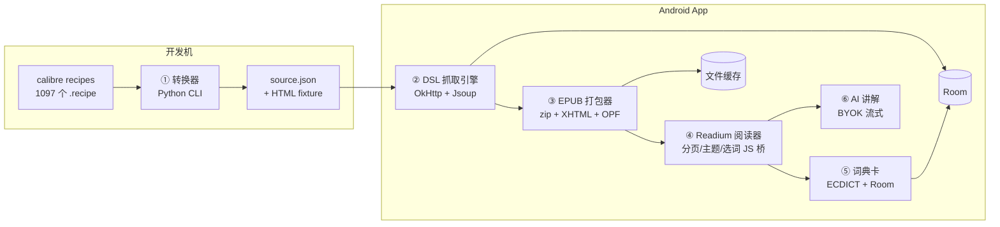

# Handypage 设计文档

- **版本**: v0.1(初稿)
- **日期**: 2026-07-20
- **状态**: 待评审
- **一句话定义**: 一个免费开源的 Android 英语阅读器——把 calibre 生态的新闻源抓取算法移植到移动端,配上词典与 AI 讲解,服务英语学习者。

---

## 1. 项目定位与目标

### 1.1 三个目标(按优先级)

1. **自己学英语**:作者本人是日活用户,功能取舍以"自己每周真实使用"为唯一标准(狗粮驱动)。
2. **培养 vibecoding 能力**:项目是 AI 协作开发的训练场,spec 先行、任务切小、每行 review。
3. **简历项目**:工程化、可展示、有完整叙事(见 §10)。

### 1.2 设计约束(不可妥协)

- **无后端**:一切抓取、渲染、存储发生在设备上。服务器成本永远为零。
- **免费开源**:GPLv3,GitHub Releases 分发 APK。
- **BYOK(Bring Your Own Key)**:AI 功能由用户填自己的 API key;无 key 时核心功能(抓取/阅读/词典)完全可用。
- **借船出海**:内容源与抓取算法思想来自 calibre(1097 个 recipes),不重复造解析规则的轮子。

### 1.3 非目标(明确不做)

- iOS / 桌面端(仅 Android,APK 分发)
- 账号体系、云同步、社交
- 付费墙/登录后才能看的源(只收公开可访问内容)
- 内容再分发(App 不内置、不中转任何成品内容,抓取行为发生在用户自己设备上,性质同 RSS 阅读器)
- TTS 朗读、单词复习推送(列入 backlog,不在本期)

---

## 2. 核心设计决策(ADR 摘要)

| # | 决策 | 选择 | 理由 | 否决项 |
|---|------|------|------|--------|
| D1 | 平台 | 仅 Android | 零分发摩擦;无 App Store 2.5.2(禁下发可执行代码)约束;个人项目聚焦 | iOS、全平台 |
| D2 | 客户端技术栈 | Kotlin + Jetpack Compose | 原生质量;AI 代码生成一等公民;简历关键词 | Flutter(EPUB 渲染生态不达标,见 D3) |
| D3 | 阅读渲染 | Readium Kotlin Toolkit(EPUB) | "类 Kindle 精排版"是底线需求;Readium 是工业级开源 EPUB 引擎(分页/字体/主题/夜间模式开箱即用);Flutter 侧无等价物 | 自研分页 WebView、epub.js |
| D4 | 抓取引擎形态 | 自研 JSON DSL 引擎 | recipe 的规则(URL/选择器/清洗)可声明式表达;跨架构移植合法清晰;简历核心故事 | 嵌入 Python 运行时(Chaquopy):体积大、维护难、锁死 Android |
| D5 | 内容中介格式 | EPUB(端上打包) | 与 calibre 产出同构,对照移植心智成本低;Readium 直接消费;书架/目录/进度天然成立 | 直接渲染 HTML 字符串(丢排版与结构) |
| D6 | 词典 | ECDICT 开源词库 → 本地 SQLite | 毫秒级点词;含音标、词性、**词形变化(lemma)字段**,适合学习者;零 API 成本 | 纯网页查词弹窗(体验不达学习 App 及格线) |
| D7 | AI | BYOK,OpenAI 兼容协议抽象 | DeepSeek/OpenAI/Gemini 一套协议通吃;用户自付成本,项目零合规负担 | 自建 AI 后端(违反无后端约束) |
| D8 | 内容更新方式 | 按需抓取(非整刊下载) |  calibre 桌面模式是整刊打包,手机流量/电量不适用;先抓轻量列表,点哪篇抓哪篇 | 整刊定时下载 |
| D9 | UI 落地形态(M5,定稿) | Compose + Material 3 一体化,含阅读器 | 全局迁 Compose;阅读器也入 Compose 树:`ReaderActivity` 纯 Compose 宿主,Readium 的 `ReaderFragment` 经 `AndroidFragment` 作为 M3 `BottomSheetScaffold` body 嵌入——BottomSheet/覆盖层两条岔路踩坑后(见 M5 验收)此为唯一兼顾抽屉手势与 WebView 渲染的形态 | 全量 Compose 化重写阅读器 navigator(风险大于收益) |
| D10 | Agent 形态(M5) | 窄工具集 + 代码闸门 | 工具(function calling)代码侧定义与执行,UI 只信数据库回执不信模型口述;工具循环硬上限 5 轮;token 用量逐笔记账 | prompt 里写"你必须调用工具"(模型可跳过,不可审计) |
| D11 | 论文阅读形态(M12) | 双轨:pdf.js 原版视图为主 + 重排 EPUB 为辅 | 文本抽取重排对双栏/公式/图内文字是结构性天花板(M11 真机三连翻车实证);pdf.js 文本层选区可桥接全部学习功能,版面 100% 保真;重排 EPUB 转任"小屏重排模式 + AI 正文上下文来源",一份产物两个用途 | 继续调阈值打磨文本重排(打地鼠);Readium PDF navigator(选区/高亮交互体系不兼容) |
| D12 | 阅读器视觉统一(M16) | 编辑排印延伸进阅读器 chrome:Compose 报刊顶栏(点按显隐)+ Aa 设置 Compose 底部面板 + 词卡/AI 抽屉共用「2dp 实墨顶线」签名 | 设计系统已定稿(`docs/design-system.md`),阅读器是延伸不是新方向;顶栏显隐走 WebView 非消费 GestureDetector(`onSingleTapConfirmed`),与双击查词/翻页/长按选词零冲突;先出可交互 web 样机确认再动原生代码 | 浮动 FilledTonal 按钮组(违「禁悬浮卡片」);保留 AppCompat Aa 对话框(全局最出戏的一件);Readium 内部注入 CSS 改 chrome(侵入引擎,升级易碎) |
| D13 | 论文阅读器视觉统一 + AI 抽屉去手势化(M17) | 论文阅读器同步 M16 chrome(报刊顶栏+点按显隐,kicker=arXiv·分类·年份);两个阅读器的 AI 抽屉统一改为纯动画浮层 `AgentDrawer`(AnimatedVisibility slide,全高),废 BottomSheetScaffold 拖拽手势,关闭=头部细线圆环 × 钮/系统返回 | 拖拽关闭与对话列表滚动、文章翻页在同一手势通道打架(用户手测实证误触);浮层自身成为 pointer-input 目标即天然阻断穿透,比 sheet 的 confirmValueChange 博弈简单可靠;点按显隐在 pdf.js 侧走 JS click 桥(选区空守卫 + 260ms 双击缩放去抖),与 EPUB 的 GestureDetector 方案同语义不同实现 | 保留拖拽仅加 confirmValueChange 限制(手势冲突仍在,治标);星标单色 filled/outlined 区分(24dp 下字形差异不足,改「实心墨=已藏/空心灰=未藏」双重编码) |
| D14 | 文章身份解析(M20) | articleUrl 一律从阅读记录表按 EPUB 路径反查(`recordForEpubPath`),OPF `dc:source` 读取仅作 fast path | M20 联调实证:Readium 的 OPF→RWPM 转换丢弃 `dc:source`(非 RWPM 一级属性),`metadata["source"]` 恒 null——M8 起 EPUB 侧存的生词/好句/聊天 articleUrl 全为空串(拉库实证);阅读记录表本来就是 url↔epubPath 的规范 join(同一 sha256 源),arXiv 重排 EPUB 同样命中,PDF 原版与重排两视图天然对齐 | 读 Readium otherMetadata 里的 namespaced key(实现细节,升级即碎);按 articleTitle 回查(标题可撞,不可靠);db 迁移回填历史行(生词无 title 列填不回,半修不如不修) |
| D15 | 全局动效(M22) | B · 墨线轴线:M3 emphasized 三曲线 + 纵轴语义(前进一步上推/返回下沉),token 单点(`HpMotion`),刊头壳层托管不参与 tab 过渡 | 四方向预览用户选定 B(拨盘 5/5/6);刊头是四 tab 共享结构件,整屏过渡使它位移(读作"跳动")或连带静止(读作"无过渡")——唯有把它剥离出过渡域(壳层渲染,只换字)才能同时满足"位置不动"与"过渡可见";指示器单件滑动取代逐项跳变(空间连续性) | A 纯淡变(用户判"几乎没了");C 共享元素编排(列表在 MainActivity/阅读器独立 Activity,真共享元素需 overlay 伪造,成本不成比例);D 全 spring(与 M17 去手势化与报纸气质双重冲突);M3 动态色 MotionScheme 库(引入版本依赖,自写 token 三曲线足矣) |
| D16 | arXiv 限流与重试(M25) | 限流闸内置进 ArxivApi:app 级单例 ArxivGate(≥3s 间隔,monitor 串行所有调用方)+ 指数退避(3s→9s→27s+jitter,Retry-After 优先,429/5xx/socket 超时最多 3 次)+ 查询 TTL 缓存(10min)+ per-key single-flight + 超时分级(查询 45s,下载 connect15s/read30s 无总上限,HTML 30s 最多 2 次) | 旧设计"节流是调用方的责任",UI/Agent/下载三套各管各的,同一 IP 叠加超速被封(用户实证);查询写死 15s、下载吃 OkHttp 默认 10s 是国内慢链 timeout 主因;闸门关进管道层后任何新调用方自动合规,且缓存让重复搜索零请求 | 继续调用方自觉(已被证伪);引入第三方限流库(20 行 synchronized 覆盖全部需求,不值一个依赖) |
| D17 | 文章图片(M28) | 抓取时下载图片内嵌进 EPUB(calibre 式),src 重写为包内相对路径;arXiv 重排共用同一嵌入管线 | 取证三连:① 阅读器 WebView 远程加载被 CDN 防盗链 403(img2.chinadaily 要求完整浏览器头组,UA+Accept:image/*+Referer 缺一不可,curl 实证);② 协议相对 `//host` 图在本地服务页里降级成明文 http,被 Android 网络安全策略拒收;③ 内嵌顺带解决离线阅读(缓存文章图永存)。失败保留远程 src 兜底,不比改造前差 | WebView 远程加载(防盗链绕不过,离线即死);仅修 URL 不内嵌(403 依旧);图片走代理占位图(无后端约束下无意义) |

---

## 3. 总体架构



### 模块职责

| 模块 | 职责 | 关键依赖 |
|------|------|----------|
| ① 转换器(开发机) | 从 calibre recipe 半自动提取规则 → 生成 source.json 与测试 fixture | Python、calibre 源码 |
| ② DSL 抓取引擎 | 读 source.json;抓索引页解析文章列表;按需抓正文、清洗、本地化图片 | OkHttp、Jsoup、Coroutines |
| ③ EPUB 打包器 | 把单篇/单期内容组装为 EPUB3(章节、nav、图片、元数据) | java.util.zip |
| ④ 阅读器 | Readium 打开本地 EPUB;阅读设置;选词事件桥接 | Readium Navigator |
| ⑤ 词典 | 选词 → 词形还原 → 查 ECDICT → 底部词卡面板(M8 起非模态);加入生词本;生词文内弱高亮 | Room、ECDICT 转库脚本、Readium Decoration |
| ⑥ AI | Provider 抽象;句子/段落讲解;流式输出 | Retrofit + SSE |
| 存储层 | 元数据(Room)+ 文件缓存(EPUB/HTML/图片)+ 设置(DataStore) | Room、DataStore |

---

## 4. 模块详细设计

### 4.1 源配置 DSL(source.json)v1.1

```jsonc
{
  "id": "npr",
  "name": "NPR",
  "language": "en",
  "version": 1,                     // 配置变更时递增,便于更新与失效追踪
  "homepage": "https://www.npr.org/",
  "needs_proxy": false,             // v1.1:CN 用户是否需要代理才能访问(源管理页提示)
  "origin": { "type": "calibre_recipe", "id": "npr" },  // 或 handypage_builtin(自建)
  "index": {                        // 对应 BasicNewsRecipe 的 parse_index/feeds
    "type": "rss",                  // rss:引擎通用解析 item(title/link/pubDate/description),无需站点专属选择器
    "url": "https://feeds.npr.org/1001/rss.xml",
    "max": 20
    // type: "html" 时改为:
    // "link_css": "a[href*='/a/']",        // 文章链接锚点(Jsoup CSS,v1.1 起选择器不再加 "css:" 前缀)
    // "link_regex": "/a/\\d{6}/\\d{2}/WS[0-9a-f]+\\.html$",  // 锚点 href 过滤
    // 标题取锚点文本(同 URL 多锚点取最长文本);无文本时回退 slug 人性化
  },
  "article": {                      // 对应正文提取与清洗
    "content": "#storytext",        // 正文容器(对应 keep_only_tags)
    "title": "h1",                  // 可选:缺省用索引页标题
    "remove": [".bucketwrap", "aside"],  // 对应 remove_tags,支持 :first-of-type 等伪类
    "encoding": null                // 可选:缺省自动探测
  },
  "request": {
    "delay_seconds": 1,             // 对应 recipe 的 delay,礼貌抓取
    "user_agent": null              // 可选:缺省用内置桌面 UA
  },
  "reader_css": null,               // 对应 extra_css,注入阅读页
  "notes": "人工 review 备注(改版历史、坑)",
  "test": { "fixture": "fixtures/npr/" }
}
```

**v1.1 变更**(源验证阶段结论):① 增加 `index.type`——RSS 源索引零选择器、抗改版;HTML 源用 `link_css`+`link_regex`;② 增加 `needs_proxy`;③ 选择器去掉 `css:` 前缀(v1 只有 Jsoup CSS 一种引擎);④ 增加 `origin`/`notes` 溯源字段。

**能力边界(v1 明确不支持)**:登录/cookie 流程、JavaScript 渲染页、GraphQL/私有 API、验证码。命中这些特征的 calibre recipe(约 25 个 webengine 类 + 复杂脚本类)直接放弃——目标源池只需 15-20 个。

**与 calibre 算法的映射关系**(移植时的对照表):

| calibre (BasicNewsRecipe) | Handypage DSL |
|---|---|
| `feeds` / `parse_index()` | `index.*` 选择器组 |
| `keep_only_tags` | `article.content` |
| `remove_tags` / `remove_tags_after` | `article.remove[]` |
| `extra_css` | `reader_css` |
| `delay` | `request.delay_seconds` |
| `max_articles_per_feed` | `index.max` |
| `preprocess_html()`(简单 DOM 改写) | v2 增加 `transform[]`(有限改写规则);复杂的一律弃源 |
| 并发抓取 | 引擎内协程池(固定并发=4) |

### 4.2 DSL 抓取引擎

**流程(按需抓取,对应 D8)**:

```
refreshIndex(sourceId)
  → GET index.url(带 UA、超时 15s、遵循 delay)
  → Jsoup 解析 → 文章条目列表(标题/URL/摘要/日期)
  → 写入 Room(去重:URL),返回增量

fetchArticle(articleId)
  → 若本地已有 EPUB 缓存,直接返回
  → GET 文章页 → 按 article.* 提取正文容器
  → 清洗(remove[]、剔除 script/style/iframe、相对链接转绝对)
  → 图片:本地化到缓存目录,img src 重写为 file://(可选省流模式:只留链接)
  → 交给 EPUB 打包器 → 更新 Room 状态
```

**工程细节**:

- 失败处理:每个源独立 try/catch,失败仅标记该源(带错误原因),绝不 crash;连续 N 次失败在源管理页标黄(提示"源可能已改版,等待配置更新")。
- 礼貌抓取:单源串行 + delay;全局并发 ≤4;指数退避重试 2 次。
- 编码:遵循 `article.encoding`,缺省用 Jsoup 自动探测。
- 入口:`WorkManager` 支持手动刷新与可选的每日定时刷新(默认关闭,省流量)。

### 4.3 转换器(Python CLI,开发机工具)

定位:**一次性/低频运行的移植辅助工具**,不进 App。

- 输入:calibre `recipes/*.recipe` 文件
- 做法:AST 解析 recipe 类,提取可声明化的属性(上表左列),生成 source.json 草稿;无法自动提取的标注 `"needs_manual_review": true` 并给出原因
- 同时抓取一份真实页面存为 fixture(索引页 + 1 篇文章页),供 §8 测试用
- 输出目录约定:`sources/`(JSON)+ `sources/fixtures/<id>/`
- **人工兜底**:转换器只做粗加工,每个源最终由人 review 选择器并实测——15-20 个源的工作量可接受

### 4.4 EPUB 打包器

- 产物:EPUB 3(单篇成书;v2 再考虑按期合刊)
- 结构:`mimetype` / `container.xml` / `content.opf` / `nav.xhtml` / `chapter-1.xhtml` / `images/`
- 元数据:标题、来源名、原文 URL(`dc:source`)、抓取时间、语言 `en`
- 注入阅读 CSS:内置阅读样式(字号阶梯、行高、段距)+ source 级 `reader_css`
- 实现:手写 zip 组装(EPUB 是固定结构 zip,无需引入重型库);输出到 `files/epubs/{articleId}.epub`

### 4.5 阅读器(Readium 集成)

- 依赖:`readium-streamer`、`readium-navigator`(Kotlin toolkit)
- 打开本地 EPUB 文件 → Navigator 渲染;使用其内置的分页、字体缩放、主题(日/夜/羊皮纸)、边距设置
- **选词桥(本设计唯一需要手写 JS 的点)**:
  1. 通过 Navigator 的 JS 注入能力监听 WebView 内 selection 变化
  2. 取选中词 + 所在句子(供 AI 上下文)
  3. 桥回 Kotlin → 触发词典卡(§4.6)
- 阅读进度:Readium `Locator` 序列化存入 Room,复读恢复

### 4.6 词典与生词本

- 词库:ECDICT(`stardict.csv`,约 340 万条)→ 开发机脚本转为 SQLite,随 App assets 打包(压缩后体积可接受;首次启动解压至 filesDir)
- **查词链**(学习者场景关键):原词 → 小写化 → **lemma 词形还原**(ECDICT `exchange` 字段自带 lemma,如 running→run)→ 命中则展示词卡
- 词卡内容:音标、词性、中文释义、英文释义、词频等级(若有);"加入生词本"与"问 AI"两个动作
- 生词本:Room 表;记录单词 + 出处句子 + 文章链接;列表页按时间/字母序;复习功能 v2(简单艾宾浩斯提醒)

### 4.7 AI 模块(BYOK)

```kotlin
interface AIProvider {
    val name: String
    fun streamChat(messages: List<ChatMessage>): Flow<String>  // SSE 流式
}
```

- 预置:DeepSeek(默认,国内便宜)、OpenAI、Gemini(OpenAI 兼容端点)、自定义 base_url
- key 存储:`EncryptedSharedPreferences`(Keystore 加密);仅在设置页输入,永不外传到第三方
- 内置 prompt 模板(v1 三个):
  1. **讲句子**:语法拆解 + 生词标注 + 中文翻译(输入:选中句 + 所在段)
  2. **讲单词**:语境释义 + 搭配 + 例句(输入:词 + 所在句)
  3. **文章导读**:摘要 + 3 个理解问题(输入:全文,注意 token 截断)
- 成本透明:设置页显示各 Provider 当前模型与预估单价提示;默认选用各家最低价模型

### 4.8 存储层

**Room 实体**:

| Entity | 关键字段 |
|--------|----------|
| `Source` | id、name、json 原文、enabled、fail_count、last_fetched |
| `Article` | id、source_id、title、url、summary、published_at、fetched_at、epub_path、status(new/downloaded/error) |
| `VocabWord` | word、lemma、phonetic、definition、sentence、article_id、added_at、review_stage |
| `ReadProgress` | article_id、locator_json、updated_at |

**文件布局**:`files/sources/*.json`、`files/epubs/`、`cache/images/`、`files/dict/ecdict.db`

**设置**:DataStore(API key 引用、默认 Provider、阅读偏好、省流模式开关)

### 4.9 Agent 框架(M5)

把 M3 的"三个无状态 prompt 模板"升级为**按文章持久化的会话 Agent**:有上下文、能调工具、每轮可追问。自主推送/喜好学习明确不做(见 §1.3 与 M6+ backlog)。

**构成**:

```
AgentRunner(会话循环)
  ├─ ContextBuilder:system prompt + 文章正文(截断)+ 近 N 条历史(字符预算内)
  ├─ tools: List<AgentTool>  ← 代码侧注册,OpenAI function calling 协议下发
  ├─ 流式:provider 增量 → UI 事件(正文/思考/工具调用中/工具回执)
  └─ 记账:每轮 prompt/completion tokens → Room agent 日志 + 日预算闸门
```

**工具集(v1 三个,窄而只读为主)**:

| 工具 | 参数 | 动作 | 回执来源 |
|------|------|------|----------|
| `lookup_word` | word | 查 ECDICT(词形还原链) | 词典库 |
| `save_vocab` | word, sentence | 写入生词本 | Room 插入行号(模型只收到"已保存 #id",UI 以数据库为准) |
| `get_article_text` | — | 返回当前文章正文(截断) | 本地 EPUB |

**硬闸门(代码强制,非 prompt 自律)**:

- 工具循环上限 **5 轮**,超出即收尾并提示;
- 每轮复用首 token watchdog(60s);工具结果截断 2000 字符;
- **日 token 预算**(默认 20 万,设置页可调/关):每次调用记账(prompt+completion tokens,取流式末包 usage),超预算拒绝调用并明示;用量记录在设置页可见;
- 文章正文以"不可信数据"名义注入 system prompt 说明,防注入。

**会话持久化(Room,并入现有 handypage.db,version 2)**:

| Entity | 关键字段 |
|--------|----------|
| `ChatSession` | id、article_key(EPUB 相对标识/URL)、title、created_at、updated_at |
| `ChatMessageEntity` | id、session_id、role(user/assistant/tool)、content、tool_name、tool_call_id、tokens、created_at |

每篇文章一个会话,重开阅读器可续聊;会话列表入口在生词本页(v1 从简)。

**Provider 协议扩展**:`streamChat(messages, tools)`;SSE 增量解析 `delta.tool_calls[]`(index/id/name/arguments 分片累积),流末汇总为完整工具调用请求交回 AgentRunner 执行。DeepSeek/OpenAI 均兼容;`stream_options.include_usage=true` 取 token 用量。

**对话面板(阅读器抽屉,M5 定稿实现)**:Compose 一体化承载——`ReaderActivity` 是纯 Compose 宿主,`ReaderFragment` 经 `AndroidFragment`(fragment-compose)作为 M3 `BottomSheetScaffold` 的 body 嵌入;抽屉 `sheetPeekHeight=0`(默认 Hidden,零遮挡),底部 48dp 上滑唤出区 + 标准拖拽把手,右上角三枚 FilledTonalIconButton(阅读设置/导读/问 AI)。三个入口归并进同一会话:"导读""讲句子"把模板 prompt 作为用户消息发进当前会话(display/prompt 分离,气泡显示短文本),点词词卡的"问 AI"带词+句上下文开抽屉。面板内 Markdown 渲染(Markwon 包 TextView;流式中退化为纯文本,避免逐 token 重解析)。M16 顶栏并入报刊 chrome(§4.18);M17 起 BottomSheetScaffold 改为纯动画 `AgentDrawer` 浮层,拖拽手势废除,关闭走头部 × 钮/返回键(§4.19,D13)。

> 注:本节与 D9 是 M5 重构三轮后的最终形态(View BottomSheetBehavior → 全屏 Compose 覆盖层 → AndroidFragment 内嵌),与下文初稿描述不同的以此为准。

### 4.10 本机内容与全局 Agent(M7)

**信息架构**:主页改为三 tab(Material 3 `NavigationBar`):**源 / 本机 / Agent**;文章列表与 AI 设置为其上的全屏页;tab 间 `saveState/restoreState` 保留滚动与会话状态。

**阅读记录与离线缓存**:`article_records` 表(Room,db version 3)每篇打开过的文章一行(url 唯一,title/sourceId/sourceName/epubPath/firstOpenedAt/lastOpenedAt)。EPUB 打包本就以 URL 哈希为稳定文件名落盘,记录表即离线索引——文件在则点击直开阅读器,零网络;删除记录连带删文件。upsert 用 insert-IGNORE+update 事务,不用 `ON CONFLICT DO UPDATE`(minSdk 24 部分设备 SQLite < 3.24)。

**本机 tab**:`SegmentedButtonRow` 切换「文章 / 生词」;文章列表显示已缓存徽标、来源与最近打开时间;生词即原 VocabScreen 内容(去壳为 `VocabBookContent` 复用)。

**全局 Agent 会话**:Agent tab 是与文章无关的自由对话页,复用 `ChatPanel` + `ChatController`;会话以 `article_key="global"` 持久化,跨文章、跨重启延续;不注册 `get_article_text` 工具(无文章,避免对空文本的幻觉调用);`ChatPanel` 参数化:onQuickGuide 可空(隐藏导读行)、inputHintRes(全局话术)、applyInsets(抽屉内自管理 inset,tab 内交给 Scaffold)。

**源 DSL v1.2**:`SourceConfig` 新增可选 `category`(learning/news/science/tech,默认 news),源 tab 按分类分组渲染卡片(首字母徽标 + 名称 + 域名)。

### 4.11 阅读体验:非模态查词面板与生词弱高亮(M8)

**查词面板(替换 M2 弹窗)**:M2 的 AppCompatDialog 词卡(模态、压暗、抢焦点)改为阅读页布局底部的持久面板(`WordCardPanel` + `word_card_container`,旧 `WordCardDialog` 删除):无遮罩、不抢焦点,面板外触摸直达文章;连续查词原地重绑;释义区 NestedScrollView 限高约 45% 屏,长释义内部滚动;✕ 或返回键收起(OnBackPressedCallback 随可见性启停);保存后不收起(不打断阅读),按钮经 `exists(word, articleUrl)` 预查渲染「加入生词本 / 已在生词本中」两态。问 AI 开抽屉时面板自动收起(Back 语义与屏幕归属唯一)。

**生词弱高亮**:走 Readium Decoration API 而非 JS 改 DOM(零重排、天然主题安全)。开书/保存生词/切换主题时:DAO `word UNION lemma` 取词表 → `Publication.search(term, wholeWord=true)` 定位全文所有出现 → Kotlin 侧以 locator 的 before/after 边界字符复核整词(防搜索后端退化为子串匹配,把 art 点亮在 start 里)→ 整组重刷 `Decoration.Style.Highlight`(group=`vocab`,低透明琥珀,三主题各自 tint,alpha ≤ 0x52)。上限 400 词 × 每词 100 处防大开销。纯函数 `VocabHighlight`(normalizeTerms / isWholeWordMatch / tintForTheme)入 JVM 单测。

**M8 回归与修复**:M5 的底部 48dp 上滑唤出区(Compose 覆盖层,消费 DOWN 事件)与面板底部按钮行重叠,吞掉全部按钮点击(症状"生词本加不了")。修复:面板可见期间 `ReaderShell` 撤掉唤出区(`summonZoneEnabled`),面板收起即恢复;真机回归验证通过。

### 4.12 设置 tab 与两端对齐(M9)

**信息架构**:主页底栏扩为四 tab(源/本机/Agent/**设置**);`Routes.SETTINGS` 从全屏页升级为 tab(`SettingsScreen(onBack: (() -> Unit)? = null)`,tab 形态无返回箭头),源/Agent 页的齿轮入口改走 `navigateToTab(SETTINGS)`。设置页分两区:**阅读设置**(对齐/字号/主题/页边距,`ReaderSettingsStore` 与阅读器内 Aa 对话框同一 store,互相同步)+ **AI 配置**(原 BYOK 内容)。

**对齐方式与断词**:`ReaderSettings.justified`(默认 false)→ `EpubPreferences(textAlign=JUSTIFY, hyphens=true, publisherStyles=false)`;EpubPackager 的 XHTML 模板加 `lang="en" xml:lang="en"`(CSS `hyphens:auto` 无 lang 不生效;仅对新抓取的文章生效,旧缓存重抓后获得)。阅读器内 Aa 对话框同步加对齐单选。

**Readium 3.3.0 排障记录(重要)**:仅设 `textAlign=JUSTIFY` 完全不生效——ReadiumCSS 里所有 textAlign 规则都门控在 `readium-advanced-on` 之后,而 advanced 模式 = `!publisherStyles`(字节码验证:`EpubSettingsKt.update` 将 `advancedSettings` 置为 publisherStyles 取反)。默认尊重出版方样式时 JUSTIFY 静默渲染为左对齐。修复:justified 时 `publisherStyles=false`。附带发现:advanced 模式下 Readium 对 justify 自动开启 body hyphens(显式 `hyphens=true` 为双保险)。另:justify 切换会触发资源重载丢弃 Decoration,`applyReaderSettings` 在主题或 justified 变化时都重刷生词高亮;h1 在 READER_CSS 中固定 `text-align: left`(大标题两端对齐词距难看)。

### 4.13 好句收藏与笔记(M10)

**数据层**:`saved_sentences` 表(db v4,`MIGRATION_3_4`):`text`(归一化)+ `note`(手动注释)+ `aiNote`(AI 笔记)+ `articleUrl`/`articleTitle`/`sourceName` + `addedAt`;`(text, articleUrl)` 唯一索引去重(文本列默认 `""` 而非 NULL——同 VocabWord,规避 SQLite 唯一索引把 NULL 当互异的陷阱)。`SentenceText.normalize` 折叠全部空白为单空格并 trim(EPUB 选区跨元素会带换行),收藏与查重同口径,纯函数入 JVM 单测。

**收藏入口(零摩擦)**:选区浮动菜单加「收藏句子」(顺序:查词/讲句子/收藏句子/复制,`WordActionModeCallback` 扩为四回调)。`ReaderFragment.onSaveSentenceAction` 复用选区捕获套路(currentSelection→clearSelection→finish),normalize 后从 OPF 元数据取证(dc:source/title/creator)INSERT IGNORE,toast 两态(已收藏/已在好句本中);**不弹面板、不打断阅读**——注释与 AI 笔记统一留待本机 tab 后期加工。

**好句本 UI**:本机 tab 分段 2→3(文章/生词/好句)。`SentenceBookContent` 镜像 `VocabBookContent`:行 = 句子两行截断 + 日期/来源,已有加工的带「注释 · AI 笔记」标记;点按开详情对话框(全文 SelectionContainer 可复制),长按弹删除确认。对话框目标按 id 对 Room 实时列表解析,note/aiNote 更新即时回显、他处删除自动关框(不存 stale 副本)。

**注释与 AI 笔记**:手动注释 = 二级对话框 OutlinedTextField(预填、trim 落库)。AI 拆解 = 一次性流式请求(`AIFactory.fromSettings` + `Prompts.annotateSentence`:翻译/语法拆解/重点词汇,≤250 字;与 M3 讲句子的差异:无 live 上下文参数、面向可留存笔记):Content 增量实时流入对话框,Reasoning 只切「思考中…」占位不渲染;完成后 `updateAiNote` 落库,失败 toast 且旧笔记不动;生成中按钮禁重复触发,关框取消流(DisposableEffect);无 key 时 toast 引导去设置 tab。

**Markdown 渲染**:AI 笔记成品走 Markwon——ChatPanel 的私有实现提为共享 `ui/MarkdownText.kt`(AndroidView 包 TextView);**流式进行中保持纯文本**(半成品标记重解析无意义且闪烁),完成后切换 Markdown 渲染,与聊天气泡同一策略。

### 4.14 论文获取层:arXiv + 双轨阅读(M11/M12)

**范围**:面向英语学习者的论文阅读。arXiv 公共 API(无 key)——`export.arxiv.org/api/query` Atom(Jsoup XML 解析,`ArxivApi`):搜索(`all:"…"`,relevance 排序)+ 分类浏览(`cat:cs.CL` 等,5 个预设 chips:cs.CL/cs.LG/cs.CV/cs.AI/stat.ML);3s 礼仪限速 + Mutex 串行 + 竞态防护。PDF 流式下载(`.part`→rename,进度回调,Windows 上 rename 前先删目标)。源以 `index.type: "arxiv"` 进 assets 源体系(category `papers`),`ArticleListScreen` 按类型分派到专属界面(搜索框 + 分类 chips + 卡片列表),RSS/HTML 分支零改动。

**双轨阅读架构(M12 定稿,本轮核心决策 D11)**:

- **原版视图(主,`paper/PaperReaderActivity`)**:pdf.js 6.1.200 **legacy build** 入 assets(5.2MB,含 cmaps/standard_fonts;现代构建依赖 `Uint8Array.prototype.toHex`,Chrome 139+ 才有,本机 WebView 134 直接崩 `hashOriginal.toHex is not a function`)。自写 `viewer.html`:fit-width + DPR cap 3(物理像素 1:1 矢量渲染)、IntersectionObserver 提前 1.5 屏懒渲染、`TextLayer` 透明文本层、`.textLayer ::selection{color:transparent}`(防文本层字形与 canvas 叠成双影)。WebView 虚拟域 `paper.local` 经 `shouldInterceptRequest` 供流(assets 与 `files/papers/`,禁路径穿越;整本加载无 range)。
- **选区复用全链路**:JS `selectionchange` 防抖桥回 Kotlin;`PaperWebView` 以**委托式** `ActionMode.Callback2` 包住系统回调——只换菜单项(查词/讲句子/收藏句子/复制),`onGetContentRect` 透传 Chromium 原回调让浮动菜单锚定选区(整体替换会丢锚点、菜单回落顶栏),并 force `TYPE_FLOATING` 防顶置 contextual bar。四个动作接 M8/M3/M10 现有件(WordCardPanel 直接复用、ChatController、savedSentences);`__setVocabTerms` 注入生词表,文本层 span 整词包裹实现弱高亮(幂等可回滚)。
- **重排 EPUB(辅,一产物两用)**:重排模式(小屏友好)+ **AI 对话/导读的正文上下文**(pdf.js 视图正文只有 canvas 像素,AI 拿不到文本)。生成链路:**arXiv 官方 HTML 版优先**(`arxiv.org/html/<id>`,ar5iv 服务端转换,公式 MathML/图/表格俱全;`ArxivHtml.toArticle` 提取 `article.ltx_document`、清洗页面包装、img 绝对化、MathML 保留),404/失败**回退本地 PDF 抽取**:`PdfChars` 以 PDFBox `writeString` 内建词分割取词(根治自研间隙阈值的"空格双失灵")→ `buildLinesFromWords` 聚行切栏 → **XY-Cut 简化移植**定双栏阅读顺序 → 页眉页脚/页码跨页重复剔除、段落合并 + 断词还原、字号统计判标题、首页 Abstract 前跳过(作者块数字汤)、孤儿上标剔除。
- **打开流程**:下载完**即开原版**(不等解析);EPUB 在 `appScope` 后台生成(tmp+rename,成功 toast「重排模式已就绪」,失败静默仅 log);`recordOpen` 与 `epubFileFor`/`paperFileFor` 同 sha256 哈希命名;本机 tab arxiv 记录点击进原版、删除连 PDF 一起清。

**许可(用户硬性要求,已合规)**:opendataloader-pdf(Hancom,Apache-2.0)移植版面算法思路(XY-Cut/页眉页脚/字号统计),移植文件头部保留版权与修改声明;pdfbox-android(Tom Roush,Apache-2.0)字符提取底座;pdf.js(Mozilla,Apache-2.0)LICENSE 随 assets 分发。全部登记根目录 `THIRD_PARTY_NOTICES.md`。

**已知限制**:PDF 抽取路径公式降级为文本流、图不提取(HTML 版无此限制);扫描件/OCR 不支持;重复快速打开同一未转换论文会起多个后台转换(tmp+rename 兜底正确)。捏合缩放重渲染已于 M14 落地(见 §4.16)。

### 4.15 论文分类全集与星标收藏(M13)

**分类全集**:`arxiv/ArxivCategories.kt`(android-free)内置 arXiv 官方完整学科表 **154 条**(code + 官方英文名,按 archive 分组:cs 40 / math 32 / physics 22 / q-bio 10 / q-fin 9 / astro-ph 6 / stat 6 / eess 4 / econ 3 / 单分类 archive 各自成组)。chips 行 = 预设 5 + 自定义 chip(若有)+「更多」;「更多」开**分组单选对话框**(LazyColumn 按组分节,行 `code · label`,顶部 code/label 过滤框,空组隐藏);选中的非预设分类持久化到 SharedPreferences(`arxiv_custom_category`),下次进入仍在且默认选中。

**星标收藏**:与「文章」段(打开历史,被动)互补——收藏是**主动标记**,可不下载直接收藏。
- 数据:`paper_stars` 表(db v5,`MIGRATION_4_5`):`url` PK(= absUrl,与 article_records、PDF/EPUB 文件名同 sha256 源,收藏↔记录↔缓存天然对齐)、`title`/`authors`/`primaryCategory`/`published`/`starredAt`;DAO 提供 `insert(IGNORE)`/`deleteByUrl`/`observeAll`(starredAt DESC)/`observeUrls`(星态驱动)。
- 入口:arXiv 卡片尾部星形 IconButton + PaperReader 顶栏星形(读者页 intent 补传 authors/category/published 三个 extras 供落库)。
- 列表:本机 tab 分段 3→4(文章/生词/好句/收藏),`StarredContent` 镜像文章段,长按删除确认;点击:PDF 已缓存 → 直开原版;未缓存 → 走共享打开流程重下。
- **共享打开流程抽取**:ArxivScreen 原"下载→进度框→打开→后台转换"流程提为 `ui/PaperOpener.kt`(`rememberPaperOpener` + `PaperOpenDialog`),ArxivScreen 与收藏段共用,行为逐行一致(进度/取消/`.part` 清理/recordOpen/失败 snackbar「浏览器打开」;pdfUrl 由 absUrl `/abs/`→`/pdf/` 推导)。注意 `remember(context)` 必须绑 Activity context(startActivity 无 NEW_TASK,applicationContext 会崩)。

**已知边角**:从「文章」段启动的读者页缺三个 extras(ArticleRecord 无这些字段),此时收藏落库 authors/category/published 为空(布局判空不显示);补救需扩 ArticleRecord 或按 url 回查,未做。

### 4.16 论文视图捏合缩放重渲染(M14)

**机制**:pdf.js TextLayer 是 DOM 元素,缩放后浏览器自动清晰排版;canvas 是位图,不处理会发糊——`viewer.html` 监听 visualViewport `resize`,500ms 防抖后 `applyZoom`:视口 ±1.5 屏内的页面按 `clamp(DPR × zoom, baseScale, 4)` 重新渲染 canvas(离屏新 canvas 渲完才 swap,不闪白),离屏页面降回基础清晰度回收内存;串行渲染队列 + 世代计数防乱序。触摸进行中(`touchActive`)门控重渲泵,且**不挂** visualViewport `scroll` 监听(捏合伴随 scroll 事件,会造成滚动即重渲)。

**恶性回归排障记录(教训)**:M14 重构把 `renderPage` 里的 `const page = pageDiv._page` 挪进了 `renderCanvas` 作用域,`renderPage` 遗留 `page.streamTextContent()` 悬空引用 → ReferenceError;构造器 catch 里组错误消息又访问 `page.pageNumber` 二次 ReferenceError → 内层 `catch(ignored){}` 吞掉 → **全文零文本层 span、零日志**,表现为长按选不了词、查词全废。PC 端对照实验定位:`tmp/nodetest/`(puppeteer-core 驱 Edge headless + `@napi-rs/canvas` + serve.mjs 静态服务)先证实 pdf.js `getTextContent` 165 项/页完全健康(排除 PDF 本身),修复后 webprobe 复跑 totalSpans 0→1347(5 页)确认。**教训:静默 catch 链路会把离得很远的重构失误伪装成"触摸/缩放兼容问题",排障先建对照环境再猜**。

### 4.17 主界面编辑排印设计系统(M15)

**来源**:qiaomu-design 三阶段流程。Phase 1 从代码提取现状 token 并诊断(动态配色无品牌气质、源屏卡片 vs 本机裸列表分裂、区块头两套写法、设置入口 ×3、间距无 token、monogram 三色随机无语义);Phase 2 四方向预览(`design-previews/2026-07-28-main-tabs/`,本地回传服务),用户选定 **C · 排印**(拨盘:冒险 6/动效 4/密度 6),调整建议:「源」→「阅读」、分类更醒目;Phase 3 落地 Compose。**视觉唯一事实源:`docs/design-system.md`**(9 段,含 DNA 注入清单:Notion 的 whisper border `rgba(0,0,0,.10)`、暖灰阶、徽章 pill+微字距、四层低透明度影;Sanity 的单点高饱和重音纪律、大写技术标签)。

**落地要点**:`Theme.kt` 弃动态配色,固定亮色(纸 `#fbfaf7` / 墨 `#141414` / 编辑红 `#b3352b` 单点)/暗色(`#171512` / `#ece7db` / `#d4574a`)双 scheme;Fraunces 衬线(`res/font` 600/700,OFL 许可证入 `assets/fraunces/`——res/font 硬性只收字体文件)用于刊头 34/700、分类 18/600、monogram 20/600、生词 headword 18/600,中文自动回落系统栈;新建 `ui/Editorial.kt`(Masthead kicker→双语标题→真实 meta→双细线、SectionHeader 实墨通栏线、ProxyBadge、自绘 NavBar=600 字重+2dp 下划短线无色块、EditorialTabRow、间距 token)。四屏去 TopAppBar 去卡片化;刊头 meta 行全真实数据(源数/分组数/当日日期、四段计数、provider·model);「源」改名「阅读」;阅读/Agent 顶栏齿轮删除(设置入口只剩底栏,修诊断 #4);Agent 加编辑式空态(修诊断 #7);ChatPanel 气泡 ink 底/hairline 描边 4dp(逻辑零改,阅读器抽屉同享)。

**两轮制(craft-loop)**:R1 真机四屏截图,四视角评审揪出 4 处(底栏选中下划线被屏幕底缘裁切、Agent 输入框 stadium 圆角未收敛、设置分段钮圆角未收敛、刊头顶部空白过大);R2 只修这 4 处(NavBar item 垂直居中+线贴文字、输入框显式 `RoundedCornerShape(4.dp)`、`SegmentedButtonDefaults.itemShape(baseShape=shapes.medium)`、masthead 上 padding 减半),复截+暗色模式同验通过。

**已知取舍**:SettingsScreen 保留可选 `onBack`(阅读器深链 SettingsActivity 需出口,底栏入口传 null);monogram 取 20sp(设计文档 §3 与 §4.3 矛盾,从 §3);tab 切换 150ms 淡入未实现(需动 NavHost 结构,超「导航逻辑不变」约束,backlog);首轮实现曾发生 subagent 两小时零落盘事故——教训:委派实现类任务要给「禁止探索、逐文件写、最后统一构建」的硬执行顺序。

### 4.18 阅读器编辑排印延伸(M16)

**来源**:§4.17 的设计系统向阅读器(Readium 外 chrome)延伸。设计先行——可交互 web 样机 `design-previews/2026-07-29-reader-editorial/index.html`(390px 手机框,顶栏显隐/查词/Aa/AI/暗色全可点,puppeteer 六态截图两轮制)经用户确认后落地。用户三决策:① 顶栏+点按显隐(弃幽灵浮动钮/常驻顶栏);② Aa 设置 Compose 底部面板重做(弃 AlertDialog 换皮);③ 高亮淡墨底,并追加「设置里可选色板」。签名动作:**底部浮层 = 2dp 实墨顶线**——底栏、查词面板、Aa 面板、AI 抽屉共用「纸面下缘翻起一层」。

**落地要点**:

- **报刊顶栏(Compose)**:`ReaderShell` 重写,kicker(源名大写 11sp meta)+ Fraunces 17sp 单行标题 + Aa/导读/AI 图标,hairline 底缘;`AnimatedVisibility` 滑出/滑回。点按显隐走 Readium WebView 既有非消费 `GestureDetector` 加 `onSingleTapConfirmed`(`ReaderFragment`→`ReaderActivity.tapSignals`→shell 翻转),与双击查词/长按选词/翻页滑动共存零冲突。M5 的右上 FilledTonal 浮动三钮删除并入顶栏。
- **Aa 设置面板(Compose,替 AppCompat 对话框)**:新建 `ui/ReaderSettingsPanel.kt`:主题/对齐 `EditorialSegmented`(hairline 框 6dp,选中墨块纸字)、**高亮五色板**(淡墨默认/杏黄=保留 M8 旧色/青瓷/黛蓝/编辑红,色块按当前主题实时渲染,选中 2dp 墨框)、字号/页边距墨轨滑杆(tabular 输出);无遮罩——文章即实时预览,点外/返回/✕ 收起。`dialog_reader_settings.xml` 与 SeekBar/RadioGroup 样板全删。
- **高亮色板**:`ReaderSettings` 增 `highlightName`(SharedPreferences 持久化);`VocabHighlight.tintForTheme(theme, palette)` 五色×三主题,全部 alpha ≤32%(单测钉住);重刷条件加 `highlightChanged`。
- **词卡 XML 换肤**:`word_card_panel_bg` 改 layer-list(纸底+顶 2dp 墨线,去 16dp 圆角,elevation 12→4);词头 Fraunces 22sp;音标 11sp 宽字距(**不**大写)/词性大写;柯林斯墨星;hairline 分隔;按钮 `btn_ink_fill`/`btn_ink_outline` selector 4dp;lemma 去斜体(设计账本 P-1)。新建 `values/colors.xml` + `values-night/`——View 层编辑排印色板,Compose scheme 的 XML 孪生。
- **AI 抽屉**:16dp→8dp 顶圆角 + 内容顶 2dp 墨线(ChatPanel 内部 M15 已统一)。

**已知取舍**:Readium 三色主题(亮/羊皮纸/夜)仍用引擎内建页面底色,未与纸色 `#fbfaf7` 逐像素对齐(EpubPreferences 不暴露自定义页面底色,注入 CSS 否决见 D12);顶栏默认打开时可见(可发现性),首次点按后进入沉浸;`ReaderActivity` 未 exported,adb 深链不可达,验收走 UI 导航。

### 4.19 论文阅读器 chrome 同步 + AI 抽屉去手势化(M17)

**来源**:M16 的报刊 chrome 当时只覆盖了 EPUB 阅读器,论文阅读器还是 M12 的 M3 TopAppBar;且手测实证 AI 抽屉的拖拽关闭与对话滚动/翻页在同一手势通道打架。M17 一次收掉这两件事(D13)。

**落地要点**:

- **报刊顶栏(论文版)**:M3 `TopAppBar`(含返回键、「原版」副标题)删除,改覆盖式报刊顶栏,与 `ReaderShell` 同构:kicker(`paperKicker(category, published)` → `ARXIV · CS.CL · 2024` 大写 meta,空段自动脱落)+ Fraunces 17sp 单行标题,hairline 底缘,`AnimatedVisibility` 滑出/滑回。尾部三图标:重排(AutoStories,与 EPUB 导读同 glyph——两个壳里这个图标都意为「作为文章阅读」,EPUB 未转完前半透明禁用)/星标/AI。**无返回键**,与 M16 EPUB 阅读器一致走系统返回手势。
- **点按显隐(pdf.js 实现)**:EPUB 侧是原生 `GestureDetector.onSingleTapConfirmed`,pdf.js 侧无此通道——viewer.html 新增 `Handypage.onTap()` JS 桥:document click + 选区为空守卫(长按查词的 click 尾巴不算)+ 260ms 去抖(双击缩放连发两次 click 相互抵消),`PaperBridge.onTap` → `tapSignals` 翻转顶栏。
- **AI 抽屉去手势化(两个阅读器共享)**:M3 `BottomSheetScaffold` 整体退役,新建 `ui/AgentDrawer.kt`:全高浮层(8dp 顶圆角 + 2dp 墨线签名保留),`AnimatedVisibility` slide 纯动画开关;**无任何拖拽手势**——打开=底部上滑召唤/AI 图标/词卡问 AI,关闭=头部细线圆环 × 钮(`ChatPanel` 新增 `onClose` 参数,26dp hairline 圆环 + 14dp ×)+ 系统返回。浮层容器挂空 `pointerInput` 成为命中目标,点击/滚动自然不穿透到正文。`ReaderShell` 召唤区在抽屉打开时撤下(同词卡/Aa 面板的让位逻辑)。
- **星标双重编码**:单色 filled/outlined 在 24dp 下读不出差异(用户手测反馈「一直实心」)——未收藏=空心星+次要灰,已收藏=实心星+墨色,字形与色彩双通道。
- 词卡宿主 elevation 12→4(M16 词卡 drawable 本已共享,此处补上高度);`paper_original` 字符串删除。

**已知取舍**:抽屉打开时正文完全被覆盖(与原 sheet 展开同行为,不引入半高态);`paperKicker` 的年份取 published 前 4 位数字,非 ISO 格式自动脱落;顶栏 kicker 在 Compose 侧 uppercase,纯函数本身保持原样输出便于单测。

### 4.20 源第三批(M18)与网络栈加固

**准入过程**(§7 检查清单全走):从审计直连池 107 个中剔除已入包 15 个与 M6 弃用项,14 个候选当日重测(重定向链+feed 活性),刷掉 Wired(feed 荒废)、The Register(反爬挑战页)、NZ Herald(feed 剩 1 条)、Kyiv Post(400)、Mail & Guardian(404)、Strange Horizons(超时);用户选定 APOD/Phys.org/Nautilus/IEEE Spectrum/Lightspeed 后,**Phys.org 实测文章页 WAF 403(curl 全 header 伪装亦拦,同族 Tech Xplore 同病),整族出局,用户决定不补**。最终 4 源:

- **apod**(science):官方 RSS 标题几乎全空(7 条 6 空),弃用改存档页 HTML 索引(`archivepix.html`,`b a` + `ap\d{6}\.html$` 链接正则;1995 年代 markup 三十年不变);正文 `body`−`center`,标题 `center:nth-of-type(2) b:first-of-type`
- **nautilus**(science):RSS,正文 `main`−`form`−`[class*=AscendiumAdUnit]`−`div[data-aaad]`(清「Advertisement」广告标签)
- **ieeespectrum**(tech):RSS,正文 `article`(feed 混 podcast stub 页属源站形态)
- **lightspeed**(**新分类 fiction 小说**):RSS,正文 `.entry-content`,标题 `h1.posttitle`(首个 h1 是站点 logo 的坑)

**真机网络加固(两处,app 级通用)**:

1. **IPv4 优先 DNS**(`Net.kt` `handypageHttpClient()`,引擎/AI/arXiv 四处统一):真机网络 IPv6 黑洞(adb shell `curl -6` 全丢包、`-4` 正常),AAAA 站点(apod.nasa.gov)OkHttp 先试 v6 白烧 10s connect 超时。v4 优先排序,v6-only 站点仍可回退。
2. **callTimeout 15s→45s**(`SourceEngine.CALL_TIMEOUT_SECONDS`):APOD 存档索引 334KB 在慢国际链路实测 23.7s(14KB/s),而 callTimeout 覆盖整个 body 传输,15s 必掐。已知代价:APOD 列表加载约 25s(源结构决定,全量存档页),后续可换 api.nasa.gov JSON API(需 key)。

fixture 工具链沿用 M6 模式:新增 `tools/converter/save_m18_fixtures.py`(策展式选文章——跳过 spectrum 的 podcast stub 与 lightspeed 的公告首条),`probe_sources.py` CANDIDATES 补 4 条。

### 4.21 设置中心页(M19)

**来源**:用户反馈「调整与设置都暴露在外面,缺少分类的入口」。M15 的平铺长列表(阅读设置 + AI 配置一屏到底)改为 **hub-and-spoke**:中心页只放分类行,细节收进子页。

**落地要点**:

- **中心页**:`SettingsCategoryRow`(15sp/500 标题 + **实时状态摘要** + 尾部 chevron,hairline 分隔,无卡片)——阅读设置行显示「两端对齐 · 100% · 羊皮纸」(由 ReaderSettings 现算),AI 配置行显示「DeepSeek · deepseek-v4-flash」或「未配置 API Key」;摘要随保存即时反映。
- **子页**:阅读设置(对齐/字号/主题/**高亮五色板**/页边距)+ AI 配置(原 M15 全部控件,逻辑零改);各自独立刊头(READING / AI + 专属 meta),返回键/系统 back 先回中心页再退出(`BackHandler(enabled = section != null)`)。
- **高亮色板补位**:设置页此前没有高亮设置(M16 只进了 Aa 面板)——`HighlightSwatchRow` 由 private 改为共享,阅读子页与 Aa 面板同一组件、同一 store。
- **深链保持**:`SettingsActivity` 新增 `EXTRA_SECTION`,两个阅读器的「去设置」直达 AI 子页(`initialSection=Ai`)而非中心页;导航纯内部状态切换,不动 NavHost/Routes。

### 4.22 好句文内高亮(M20)

**定位**:M10 的收尾——好句本里存过的句子,重开文章时在文内以**下划线**弱高亮,与生词底色并存(底色=「这个词我查过」,下划线=「这句我收藏过」,叠加时如铅笔批注)。

**机制(镜像 M8 生词高亮)**:

- `SentenceHighlight` 纯函数对象(reader 包,镜像 `VocabHighlight`):`GROUP="sentences"` 分组重刷即替换;`normalizeQueries`(折叠空白/去空/去重/单句 ≤600 字符/全文 ≤50 句)与 `isMatch` 守卫(归一化后相等才认,防 ICU 归并把近似串放进来)入 JVM 单测;每句最多 20 处。
- 定位走 Readium search 服务(默认 ICU primary,大小写/重音不敏感);文本抽取器是 Jsoup `.text()`,**自带空白归一化**,与 `SentenceText.normalize` 的存库口径天然一致;DOM 侧 text-quote 锚定精确失败后有 bitap 近似兜底,定位失败静默不画(可接受降级)。
- 样式 `Decoration.Style.Underline(tint)`:五色板同色相但 **55% alpha**(生词底色为 14–24%——1–2px 细线在背景高亮 alpha 下不可见),单测钉死「下划线 alpha > 同板底色 alpha」。
- 触发点:开书(两个分支)、收藏句子成功(INSERT IGNORE 命中才刷)、主题/高亮色/两端对齐变更(资源重载丢 Decoration,与生词同机重刷)。

**顺手修掉的潜伏 bug(D14)**:`metadata["source"]` 自 M8 起恒 null(Readium OPF→RWPM 转换丢弃 `dc:source`),EPUB 侧存的生词/好句/聊天 articleUrl 全为空串——拉库实证(vocab_words 仅 arXiv PDF 视图存的行有值,因为那条路直接传参)。修复:新增 `ArticleRecordDao.recordForEpubPath`(M21 起返回整行,星标取 title/sourceId 同路),`ReaderFragment.articleUrl()` 挂缓存统一反查,四个消费点(好句收藏/生词卡存在性/生词落库/聊天会话)一起纠正;`setupChatPanel` 因此改为协程内建 controller。历史空串行不回填(生词无 title 列无法 join;用户现有 1 条好句已在验收时一次性修复)。

**已知边界**:PDF 原版视图不做(文本层按行碎裂,跨 span 长句匹配脆弱);PDF 视图里存的句子在重排 EPUB 里能正常下划线(两视图 articleUrl 同为 absUrl)。

### 4.23 文章收藏(M21)

**定位**:M13 论文星标的姊妹功能——普通文章(RSS/HTML 源)的主动收藏,与「文章」段(打开历史,被动)互补。三个产品决策(用户拍板):双入口(列表行尾+阅读器顶栏)、收藏段文章/论文混排带类型图标、「文章」段删记录不删收藏(与论文一致)。

**数据层**:`article_stars` 表(db v6,`MIGRATION_5_6` 纯 CREATE):`url` PK(与 article_records、EPUB 文件名同 sha256 源,收藏↔记录↔缓存天然对齐)、`title`/`sourceId`/`sourceName`/`starredAt`;比 paper_stars 多存 `sourceId`——缓存被清后按源配置重抓。DAO 镜像 paperStarDao(insert IGNORE/deleteByUrl/observeAll/observeUrls/exists)。

**双入口**:
- 列表行尾:`ArticleRow` trailingContent 星标,`observeUrls` 驱动双态;不打开文章即可收藏。
- 阅读器顶栏:Aa/导读/★/AI 第四位,`ReaderFragment` 经 `articleRecord()`(M20 记录反查扩为整行,title/sourceId 同路)发布状态;**demo 书(无记录)与 arXiv 重排 EPUB(sourceId=arxiv,星归论文视图)自动隐藏**;切换走 INSERT/DELETE 后回执刷新。

**收藏段混排**:`StarredMerge`(纯函数入 JVM 单测)把 paper_stars + article_stars 并成 `StarredItem` 时间倒序单列表;行 = 类型图标(报纸=文章/烧瓶=论文,20dp `sub` 色)+ 标题两行 + meta(论文:作者/日期·分类;文章:来源)。刊头 STARS 计数合并两表。点开:文章=缓存 EPUB 直开阅读器,缓存被清则 `Sources.load(sourceId)` 重抓→打包→recordOpen→直开(覆盖层+snackbar 两态);论文=M13 原路径不动。长按移除仅删收藏行。

**图标真相(如实记录)**:双重编码的实际渲染 = 实心墨(已藏)/实心灰(未藏)——extended 图标集的 `Icons.Outlined.Star` 是实心造型,M17 起三处星标皆然,靠色相区分;设计稿「空心灰」为意向描述,如需真空心可换 StarBorder 或自绘(未做)。

### 4.24 全局动效系统(M22)

**定位**:为 tab 切换与全部转场建立统一动效语言。流程同 M15:qiaomu-design 三阶段,四方向预览(`design-previews/2026-08-02-motion-system/`,本地回传服务)用户选定 **B · 墨线轴线**(M3 纵轴推进,拨盘 5/5/6);落选 A 纯淡变(无方向感)/C 共享元素编排(跨 Activity 成本)/D 弹簧(与纸面气质张力)。**数值唯一事实源:`docs/design-system.md` §9;token 唯一来源 `ui/Motion.kt`(`HpMotion`),组件不许自写时值/曲线。**

**token 层**:M3 emphasized 三曲线(Decel `0.05,0.7,0.1,1` 入场 / Accel `0.3,0,0.8,0.15` 退场 / Standard `0.2,0,0,1` 屏上移动)+ 六组 spec:tab(fade+rise)、axis(前进/返回)、sheet(底部浮层)、bar(顶栏)、指示器、状态微反馈;Compose 侧全覆盖,Activity 侧孪生 `res/anim/hp_axis_*.xml` + `res/interpolator/hp_{decel,accel}.xml`(pathInterpolator),`applyHpAxisOpenTransition/CloseTransition` 挂两个阅读器与 SettingsActivity(open 挂 onCreate,close 挂 finish 之前,API 34 前后双路)。

**落点**:NavHost 四 tab fade+2.3% 上推(出 90/入 210 无延迟),前进目的地(ARTICLES/HISTORY)纵轴 240/120 含返回镜像;六处 AnimatedVisibility(两阅读器顶栏/抽屉/Aa 面板)换 token;底栏与本机分段的墨线指示器改**单指示器**(透明布局孪生报位,`Animatable` 滑动 200ms,文字色 120ms 渐换);星标四处统一 `EditorialStarIcon`(crossfade 120ms);**底栏显隐**(前进/返回/IME)底滑 200/150,**托管刊头显隐**塌缩/展开 240 + 淡(§9——前进页过渡联调实证:底栏瞬灭与刊头槽位瞬塌是轴语义的两大破绽)。

**刊头壳层托管(R3 结构修正)**:四 tab 刊头经 `EditorialMastheadSlot`(CompositionLocal portal)注册进壳层 `MastheadHost`,由 MainActivity 在 NavHost 上方统一渲染(crossfade 120ms 换字,`AnimatedVisibility` 随 tab 路由显隐)——**刊头永不参与 tab 过渡**。教训链:R1 整屏位移 → 刊头跳动(用户手测);R2 纯淡变 → 「几乎没了」(用户手测);R3 结构件剥离后内容恢复上推,二者得兼。standalone 宿主(SettingsActivity)不提供 host,屏幕回落内联渲染,设置子页刊头不受影响。

**禁条(§9)**:禁编排/stagger/共享元素(C 落选)、禁弹簧(D 落选)、禁 >250ms、禁正文区(Readium/pdf.js 内部)动画。

---

## 5. 界面结构(Compose Navigation)

```
主页(M7 起三 tab;M9 起四 tab;**M15 起编辑排印设计系统**,自绘 EditorialNavBar 取代 M3 NavigationBar,设计契约 `docs/design-system.md`)
├─ 阅读 SourcesScreen(M15 改名,原「源」;刊头 masthead+真实计数 meta+双细线;分类实墨线分组;衬线 monogram 列表,去卡片化;**M22 起刊头由壳层 MastheadHost 托管**,屏内经 EditorialMastheadSlot 注册)
│    ├─ 文章列表 ArticleListScreen(按源;标题+摘要+日期;M21 行尾星标,不打开即可收藏)
│    │    └─ 阅读器 ReaderActivity(Compose 宿主;AndroidFragment 嵌 Readium)
│    │         ├─ 报刊顶栏(M16:源 kicker+Fraunces 标题+Aa/导读/AI,点按显隐;M21 加星标位,demo/arXiv 重排自动隐藏)
│    │         ├─ AI 对话抽屉(M17 起 AgentDrawer 纯动画浮层,废拖拽;底部上滑/AI 图标唤出,头部 × 钮/返回关闭;8dp+2dp 墨线)
│    │         ├─ Aa 阅读设置底部面板(M16,替 M2b AppCompat 对话框;分段钮+高亮五色板+滑杆实时生效)
│    │         └─ 查词底部面板(M8 非模态;M16 编辑排印换肤)+ 生词弱高亮(Readium Decoration,M16 起五色可选)+ 好句下划线(M20,同色族 55% alpha)
│    └─ arXiv 论文列表(ArticleListScreen 按 index.type 分派:搜索框+分类 chips,M11)
│         └─ 论文阅读器 PaperReaderActivity(pdf.js 原版视图+「重排」切 EPUB,M12;捏合缩放重渲染,M14)
│              ├─ 报刊顶栏(M17:arXiv·分类·年份 kicker+Fraunces 标题+重排/星标/AI,JS 点按桥显隐)
│              ├─ 选区浮动菜单(委托式 ActionMode.Callback2,跟随选区)
│              ├─ 查词底部面板(复用 M8)+ 生词弱高亮(文本层 span 包裹)
│              └─ AI 对话(同 M17 AgentDrawer,正文上下文取自重排 EPUB)
├─ 我的 LocalScreen(M23 改名,原「本机」;刊头壳层托管(M22)+四段真实计数 meta;EditorialTabRow 四段:「文章」阅读记录+离线直开/删除(arxiv 记录进原版视图)/「生词」生词本(headword 衬线)/「好句」句子本(M10)/「收藏」文章+论文混排(M21,类型图标;点开缓存直开或重抓;长按移除);行间 hairline;M22 分段下划线单件滑动)
├─ Agent AgentScreen(刊头壳层托管(M22)+provider·model meta;编辑式空态(M15);全局自由对话会话)
└─ 设置 SettingsScreen(M9 起为 tab;**M19 起 hub-and-spoke**:中心页=分类行(阅读设置/AI 配置,实时状态摘要+chevron;M22 中心页刊头壳层托管),子页各带刊头返回(内联渲染,不托管);阅读子页新增高亮五色板(与 Aa 面板共享 HighlightSwatchRow);阅读器「去设置」经 EXTRA_SECTION 直达 AI 子页)
```

全部界面为 Compose + Material 3(深色/浅色随系统;**M15 起主界面弃动态配色**,改固定编辑排印亮/暗双 scheme,见 `docs/design-system.md` 与 §4.17);文章阅读器独立 Activity 承载 Readium,经 `AndroidFragment` 嵌入 Compose 树,AI 抽屉为同树内的纯动画 `AgentDrawer` 浮层(M17,前身为 M3 `BottomSheetScaffold`);论文阅读器为另一独立 Activity 承载 WebView(pdf.js)。**嵌套 insets 约定(2026-08-01 修复)**:MainActivity 外壳 Scaffold 的 contentPadding 必须 `padding(padding).consumeWindowInsets(padding)` 一并消费——只 padding 不消费时,各屏内层 Scaffold 会把状态栏 inset 再垫一遍,刊头顶部出现约两个状态栏高度的留白。**动效约定(M22)**:一切转场吃 `HpMotion` token(§9);tab 间过渡只作用于 NavHost 内容域,刊头由壳层 `MastheadHost` 渲染在过渡域之外。

---

## 6. 里程碑与验收标准

| 里程碑 | 内容 | 验收(可演示) |
|--------|------|----------------|
| **M0**(1 周) | 环境 + Readium demo | App 打开内置 EPUB,分页/字号/夜间模式正常 |

> **M0 已验收(2026-07-20,OnePlus PJZ110 真机 adb)**:Gradle 9.6.0 + AGP 9.3.0 新 DSL + Readium 3.3.0 构建通过;demo.epub(由 NPR/China Daily fixture 现场打包)打开与分页正常,截图存 `docs/m0-*.png`。字号/夜间模式是 navigator 内置能力但需 App 提供设置 UI,并入 M2 阅读设置面板。
| **M1**(2-3 周) | DSL 引擎 + 转换器 + EPUB 打包,1 个源端到端 | 选定源的文章可读;fixture 测试通过;**验收"算法承载"底线** |

> **M1 已验收(2026-07-20,OnePlus 真机手动验收)**:Kotlin 版 DSL 引擎(OkHttp 5 + Jsoup,对照 `replay_fixtures.py` 移植)+ EPUB 打包器落地;11 个 JVM 单测全绿(5 源 fixture 回放,索引条目数与 Python 基准完全一致);真机上 5 个源全部可达,文章抓取→打包→Readium 阅读链路打通。构建栈:Gradle 9.6.0 + AGP 9.3.0 新 DSL。
| **M2**(2 周) | 词典卡 + 选词桥;源扩到 5 个 | 点词毫秒出卡(含 lemma 命中);**验收"阅读舒适度"底线** |

> **M2 已验收(2026-07-21,OnePlus 真机 adb 全项 PASS,截图 `docs/m2-*.png`)**:ECDICT(MIT)77 万词 + 5.7 万词形还原映射转 SQLite(86MB,压缩 38MB 入包);选词桥走 Readium `SelectableNavigator` + `selectionActionModeCallback` 零 JS 方案;词卡含音标/词性/中英释义/柯林斯星级/原形回溯(实测 died→die);生词本 Room 全流程;阅读设置(字号/日夜间羊皮纸/页边距)实时生效且冷启动恢复。修复 edge-to-edge 状态栏遮挡 bug(Android 15+ 强制,根布局加 fitsSystemWindows)。26 个 JVM 单测绿。
| **M3**(2 周) | 生词本 + BYOK AI 三模板 | DeepSeek key 下句子讲解流式输出;无 key 核心功能不受影响 |

> **M3 已验收(2026-07-21,OnePlus 真机 adb + 真实 DeepSeek key,截图 `tmp/ai*.png`、`tmp/guide.png`、`tmp/smoke7.png`)**:BYOK 四预设(DeepSeek/OpenAI/Gemini/Custom),OpenAI 兼容 SSE 流式(callbackFlow+awaitClose 取消);密钥存 plain SharedPreferences(EncryptedSharedPreferences 已被 Google 废弃)。三入口真机全通:词卡"问 AI"(5.1s 流出)、选句"讲句子"(长句 13-16s)、阅读页"导读"(6.5KB 正文 14s)。适配 deepseek-v4-pro 思考模式:解析 `reasoning_content` 增量显示"思考中…"不渲染推理正文。修复:`testConnection()` 主线程阻塞(加 `flowOn(IO)`);讲句子上下文不含选中句导致模型困惑(highlight 并入 context)。加固:60 秒首 token watchdog(SSE 无读超时,挂死连接不再无限"生成中",超时可见报错+重试)+ `HandypageAI` logcat 调试日志。PC 端对照实验证明服务端非瓶颈(2KB-40KB 上下文均 1s 内首 token,`tools/ai/repro_sentence.py`)。44 个 JVM 单测绿。
| **M4**(持续) | 源扩至 15-20;测试/CI/README/Release | GitHub Actions 绿;APK 可下载;README 含截图与架构图 |
| **M5**(3-4 周) | Agent 框架(工具调用/会话持久化/token 预算)+ 阅读器对话抽屉 + 全局 Compose/Material 3 UI | 真机:文章内多轮会话(追问生效)、工具调用真实落库(生词本可见)、抽屉上滑/收起顺滑、四屏 Material 风格;单测覆盖工具循环与预算闸门 |

> M5 范围说明(2026-07-24 与作者确认):自主推送、喜好学习**不做**(移至 M6+ backlog);GitHub 仓库暂不建;Agent 能力聚焦"单篇文章的上下文对话"。

> **M5 已验收(2026-07-24/25,OnePlus 真机 adb + 手测)**:Agent 核心(AgentRunner 工具循环/ContextBuilder 字符预算/Room 会话持久化/日 token 预算闸门)71 个 JVM 单测绿;工具调用真机落库可见(生词本回执)。对话抽屉经三轮重构定稿:① View BottomSheetBehavior(滚动冲突/遮挡正文/蹭系统手势,弃)→ ② 全屏 Compose 覆盖层(不透明 scaffold 盖住 WebView 致"文章渲染不出来",弃)→ ③ **AndroidFragment(fragment-compose 1.8.9)把 ReaderFragment 嵌入 M3 BottomSheetScaffold**,peek=0 零遮挡、底部唤出区上滑展开、把手下拉收起;三枚文本按钮换为 FilledTonalIconButton。全局四屏同步完成 Compose/M3 迁移。用户手测通过。
| **M6**(1 天) | 源第二批:无代理直连 10 源(共 15);RSS 摘要 HTML 清洗 | 新源 fixture 回放全绿;真机直连打开新源文章;摘要无裸 HTML |
| **M7**(2 天) | 三 tab 全局 UI(源/本机/Agent)+ 阅读记录与离线缓存 + 全局 Agent 会话 | 三 tab 切换流畅;打开过的文章入记录可离线直开;Agent tab 自由对话真机收发 |
| **M8**(1 天) | 查词非模态底部面板 + 生词文内弱高亮(Decoration) | 查词不打断阅读;保存即全文高亮;重开文章高亮再现;三主题 tint 自适应 |
| **M9**(1 天) | 设置 tab(四 tab)+ 两端对齐/断词 | 底栏四 tab;设置页改阅读设置+AI 配置;两端对齐带断词真机生效,来回切换无残留 |
| **M10**(1 天) | 好句收藏(选区菜单)+ 手动/AI 笔记 + Markdown 渲染 | 选句一键收藏零打断;本机三分段;注释/AI 拆解落库重开再现;AI 笔记 Markdown 渲染 |
| **M11**(2 天) | arXiv 论文源:API 搜索/分类 + PDF 下载 + 本地解析重排(XY-Cut 移植) | 搜索/分类加载论文;下载→解析→EPUB→阅读链路通;双栏阅读顺序正确;失败回退浏览器 |
| **M12**(2 天) | pdf.js 原版论文阅读器(选区四动作/生词高亮/清晰度)+ arXiv HTML 版优先重排 + 打开流程重构 | 原版渲染清晰;选择菜单浮动跟随选区;查词/讲句子/收藏/复制全通;生词弱高亮;「重排」可切换 |
| **M13**(1 天) | arXiv 分类全集(154 条分组选择器+自定义 chip 持久化)+ 论文星标收藏(本机 tab 第四段)+ PaperOpener 共享打开流程抽取 | 列表/阅读器星标切换;收藏段点开未下载论文自动重下直开;自定义分类加载对应论文;db v4→v5 覆盖安装不崩 |
| **M14**(1 天) | 论文视图捏合缩放重渲染(visualViewport 防抖 + 视口内 canvas 按 DPR×zoom 重渲)+ M14 重构回归排障 | 捏合放大后文字仍锐利;缩放态长按选词/查词/生词高亮正常 |
| **M15**(1 天) | 主界面编辑排印重设计(qiaomu-design 三阶段:诊断→四方向预览→落地)+ 设计系统锚 `docs/design-system.md` + 「源」→「阅读」 | 四屏刊头/双细线/实墨线分类/衬线 monogram 真机在屏;真实计数 meta;暗色可用;两轮制 4 处修复闭环 |
| **M16**(1 天) | 阅读器编辑排印延伸:报刊顶栏+点按显隐、Aa 设置 Compose 底部面板重做(主题/对齐分段钮+高亮五色板+滑杆)、词卡/AI 抽屉统一 2dp 墨线签名(§4.18,D12) | 顶栏显隐/双击查词/Aa 面板实时生效/五色高亮真机在屏;词卡 Fraunces 词头+墨块按钮;暗色可用;底部上滑召唤不回归 |
| **M17**(1 天) | 论文阅读器 chrome 同步 M16(报刊顶栏+JS 点按桥)+ AI 抽屉去手势化(共享 AgentDrawer 纯动画浮层,头部 × 钮关闭)+ 星标双重编码(§4.19,D13) | 论文顶栏点按显隐/双击缩放不误触;两阅读器抽屉滚动不打架、× 钮/返回关闭;星标两态一眼可分;EPUB 链路不回归 |
| **M18**(1 天) | 源第三批直连 4 源(APOD/Nautilus/IEEE Spectrum/Lightspeed,新分类 fiction)+ app 网络栈加固(IPv4 优先 DNS、callTimeout 45s)(§4.20) | 四源列表/正文真机直连可读;Nautilus 无广告标签残留;APOD 标题/正文正确;老源不回归;fixture 回放 4/4 |
| **M19**(半天) | 设置中心页 hub-and-spoke:分类行(实时摘要)+ 阅读/AI 两子页,阅读子页补高亮五色板,深链直达 AI 子页(§4.21) | 中心页两行分类+摘要;子页控件完整行为不回归;高亮色双向同步;阅读器深链落 AI 页 |
| **M20**(半天) | 好句文内高亮:收藏句子文内下划线弱高亮(同色族 55% alpha)+ 文章身份解析修复(记录表反查 articleUrl,D14)(§4.22) | 已存好句重开文章下划线再现;新收藏即时画线;换主题/高亮色跟随;生词链路不回归 |
| **M21**(1 天) | 文章收藏:article_stars 表(db v6)+ 双入口星标(列表行尾/阅读器顶栏)+ 收藏段文章/论文混排(类型图标,缓存直开或按 sourceId 重抓)(§4.23) | 列表/阅读器星切换落库;混排时间倒序类型正确;缓存直开;删记录不删收藏;v5→v6 覆盖安装不崩 |
| **M22**(1 天) | 全局动效系统(四方向预览选定 B · 墨线轴线):`HpMotion` token 层 + NavHost tab fade+上推/前进纵轴 + Activity 转场 + 阅读器 chrome 换 token + 指示器单件滑动 + 星标 crossfade + 刊头壳层托管(MastheadHost)(§4.24,D15) | 刊头位置不随 tab 切换移动;内容过渡可见;抽屉/顶栏/星标/指示器时值全部源自 token;191 单测绿 |
| **M23**(半天) | 底栏字形重塑(四方向预览 `2026-08-02-tab-icons` 选定 B · 花体手书):Pinyon Script 子集(~9KB,OFL 1.1)入 `res/font`,NavBar 图标位改花体 R/L/A/S(22sp/28dp 盒);「本机」改名「我的」(tab_local)(§4.5,design-system.md §改名) | 24dp 真机四字母可辨;选中态墨短线/字重不回归;深色模式可读;191 单测绿 |

> **M23 已验收(2026-08-02,OnePlus 真机 adb 截图自检,待用户手测)**:Pinyon Script 铜板花体在屏——R/L/A/S 四字母游丝清晰互不混淆,灰/墨双色态正确,中文标签(阅读/我的/Agent/设置)与墨短线选中态不变;刊头「我的 LIBRARY」随 tab_local 一并改名;OFL 许可证随包(assets/pinyon_script/OFL.txt,惯例同 assets/fraunces/OFL.txt)。构建插曲:res/font 目录拒收 .txt 许可文件(仅 xml/ttf/ttc/otf),移入 assets 解决。

> **M24 已验收(2026-08-02,OnePlus 真机 adb 桌面截图自检,待用户手测)**:应用图标落地——方向 A 花体字标(AI 生图 2048² → 本地修复:逐行曲线扫描去黑角、去「AI生成」水印、偏差擦除圆角描边残线 7146px,脚本 `tools/icon/fix_icon.py`);adaptive icon 三层(背景 `#F4EDE0` 纯色 + 前景透明抠图 H 居中 64% bbox + monochrome 剪影同 alpha,`tools/icon/gen_icons.py` 可重跑),legacy 圆/方各五密度,Play 512 存 `artwork/play-icon-512.png`;Manifest 从系统默认图标改 `@mipmap/ic_launcher` + roundIcon;ColorOS 真机桌面 squircle 遮罩无裁切,H 与横线完整可读。纯资源改动,无新增测试。

> **M25 已验收(2026-08-02,JVM 单测 + 用户手测回执「问题解决」)**:arXiv 超时与封 IP 双问题根治(D16)。① ArxivGate app 级单闸(≥3s 间隔,monitor 串行)取代三套各自为政的 throttle——PaperOpener.apiMutex/throttle、AgentTools 硬编码 delay(3000) 全删,rememberPaperOpener 去掉 delaySeconds 参数(3 个调用点同步);② 指数退避 3s→9s→27s+jitter,429/5xx/socket 超时最多 3 次,Retry-After 优先(封顶 120s),OkHttp「Canceled」不误重试;③ FeedCache TTL 10min + per-key single-flight,重复搜索/回退重进零请求;④ 超时分级:查询 15s→45s(对齐 M18 引擎实证),下载 connect 15s/read 30s 无总上限(大 PDF 慢链能跑完),HTML 版 30s 最多 2 次;⑤ UI 429 友好文案。插曲:release 装机后 debug 无法覆盖(INSTALL_FAILED_UPDATE_INCOMPATIBLE),debug 构建加 applicationIdSuffix=.debug + 桌面名「HandyPage Dev」实现共存,两包数据独立。**201 个 JVM 单测绿**(ArxivApiTest 新增 11:闸门间隔/退避序列/Retry-After 优先/429 耗尽/400 不重试/缓存命中/TTL 过期/并发合并/下载重试/HTML 重试)。adb 装机截图时设备熄屏未得图,链路正确性由用户手测确认。

> **M26 已验收(2026-08-03,OnePlus 真机 adb 截图三连,tmp/m26-*.png)**:阅读器内 Compose chrome 改由阅读主题全权驱动——`HandypageTheme` 加 `darkTheme` 参数(默认仍随系统,其它界面零影响),ReaderActivity 以 `normalizedThemeName == THEME_DARK` 决定明暗,顶栏/Aa 面板/AI 抽屉/对话面板与 Readium 页面同明同暗;Aa 面板切主题即时全量换肤(readerSettingsState 本就是 Compose state,无需重启/重进)。截图验收:夜间=页面+顶栏+面板+「问 AI」抽屉全暗;日间/羊皮纸=暖白 chrome 配页面,反向切换正确。已知边界:词卡面板为 View 体系(`word_card_panel_bg` 走 values-night 资源),仍随系统夜间而非阅读主题;PDF 原版阅读器无阅读主题概念,维持系统跟随。**201 个 JVM 单测绿**(纯主题接线,无新增测试)。

> **M27 已验收(2026-08-03,OnePlus 真机 adb 截图 tmp/m27-1-night.png)**:夜间阅读去眩光。取证:解包 readium-navigator AAR,ReadiumCSS-after.css 内建夜间主题为 `#FEFEFE`-on-`#000000`(纯白纯黑满对比,且纯黑违反自身设计禁令)——弃用 `Theme.DARK`,改 `EpubPreferences` 显式 `textColor`/`backgroundColor`(ReadiumCSS `--USER__` 机制,内建继承选择器自动传播全书,无需动 publisherStyles):页面 `#171512`(与暗色 DarkPaper 同色),正文墨 `#B8B3A8`(≈72% 暖灰,对比 ≈7.8:1);chrome 主文字维持 `#ECE7DB`,形成「UI 亮 / 正文柔」层次(已写入 design-system.md §2)。`toEpubPreferences` 由表达式体改块体。**201 个 JVM 单测绿**(Readium 类型非 JVM 安全,偏好映射不进单测,截图验收)。

> **M28 已验收(2026-08-03,OnePlus 真机 adb 截图 + 包级核验 tmp/m28-check.epub)**:文章图片适配(D17)。取证:① China Daily 配图 CDN(img2)对裸 curl/仅 UA/UA+Referer 均 403,完整浏览器头组(UA + `Accept: image/…` + Referer)才 200——阅读器 WebView 远程加载必死;② arXiv 重排 EPUB 图 404:ar5iv `<base>` 标签把 jsoup 解析基址带偏到 `arxiv.org/<id>/`,正确路径是 `/html/<id>/`(curl 200 实证),`ArxivHtml.toArticle` 改手工解析(`resolveArxivUrl`,`#` 锚/绝对/协议相对/根相对/相对五态),旧测试断言的正是错误地址,已纠正。实现:新 `ImageEmbedder`(纯 JVM:每图 20s/10MB/单篇 20 张上限,成功重写 `src="images/img-<sha1>.<ext>"`,失败保留远程兜底),`ArticleContent.images` 随包,`EpubPackager` 写 OEBPS/images + OPF manifest 媒体类型;SourceEngine.fetchArticle 与 arXiv 重排(PaperOpener)共用;fixture 测试传 `imageEmbedder = null` 防联网。真机:China Daily「Drying river…」新抓文章大图完整渲染(夜间底色下观感正常);拉包核验 EPUB 内含 146KB `images/img-8d1759e776d5.jpg`。**209 个 JVM 单测绿**(新增 ImageEmbedderTest 7 + EpubPackagerTest 图片 1;扩展名兜底收紧为白名单——"/trap" 类伪后缀会被当成扩展名)。已知边界:PDF 原版视图不受影响(本就渲染原图);下载失败的图仍可能裂(远程兜底)。

> **M29 已验收(2026-08-03,OnePlus 真机 adb 截图 tmp/m29-3-apod-article.png)**:APOD 图片修复——根因不是加载而是配置:M28 前 apod.json `remove: ["center"]` 把首图所在的 center#1 一起剥掉(当时图反正加载不了,剥了干净);改为 `["center:not(:has(img))", "center:has(img) h1"]`(剥标题/版权 center 与页脚 center、去 h1 横幅、保首图),ImageEmbedder 正常内嵌(apod 图床同套头组实测 200/370KB)。tools/.venv bs4 离线演练 + 真机截图双确认:首图渲染、h1 已去、Explanation 完整、日期行保留。可接受残留:center#1 内一行「Discover the cosmos」推介文字(裸文本节点,CSS 选择器够不到)。其余 18 源 remove 清单审查无同类误剥。**209 个 JVM 单测绿**(纯源配置改动,无新增测试)。

> **M30 已验收(2026-08-03,OnePlus 真机 adb 截图 tmp/m30-16-verdict.png)**:NASA 图片四连修。① 真凶=**srcset**:embed 只重写 src,残留的 srcset 远程候选在 WebView 里优先级高于 src,WebView 转去抓远程 → 裂图(China Daily 无 srcset 所以一直正常);embed 时一律剥除 srcset/sizes/loading(lazy 在分页阅读器里不触发)。② 健壮性:下载单发 20s 无重试在慢链路间歇失败(同 URL PC 秒过/手机超时,实证),加 3 次重试(2s/4s,4xx 快死不重试)+ 单图超时 30s。③ 格式归一(用户提议的 calibre 路线):Readium 对包内 webp 实证不渲染(jpg/png 正常),AndroidImageTranscoder(BitmapFactory)把 webp/avif 统一转 jpg(不透明)/png(含透明),JVM 侧留 fun interface 钩子。④ nasa.json chrome 清洗:.article-meta-item(无尺寸内联 svg 撑满屏)、a:has(svg) 分享钮、button、gravatar 头像(国内必超时)。插曲:换包调试发现 Readium 进程内按路径缓存 publication,热替换文件必须 force-stop 才生效;Readium 3.x 资源走 `https://readium_package` 伪源。**215 个 JVM 单测绿**(新增 srcset 剥除/重试×2/转码×2)。已知残留:分享钮清空后留 4 个空圆点(NASA 列表模板);NASA RSS 摘要带导航垃圾文本、标题带 `<strong>` 字面量(在案待修)。

> **M18 已验收(2026-08-01,OnePlus 真机手测)**:14 候选当日重测刷 6,用户选定 5 源中 Phys.org 文章页 WAF 403 出局(不补);4 源按 §7 准入清单走完(选择器实测→fixture→回放 4/4→单测→真机)。真机验收连环排掉两个 app 级网络 bug:① APOD index_fetch 失败,根因=手机网络 IPv6 黑洞+APOD 带 AAAA,OkHttp v6 优先白烧 10s → `Net.kt` IPv4 优先 DNS,引擎/AI/arXiv 四处统一;② 修后仍 timeout,根因=callTimeout 15s 覆盖整个 body 传输,而 APOD 存档索引 334KB 慢链路实测 23.7s → 调至 45s(APOD 列表加载约 25s 为源结构代价,已知)。**166 个 JVM 单测绿**(新增 PaperKickerTest 4→M17、SourceEngineFixtureTest 4 源用例)。源总数:19 内容源 + arXiv。

> **M19 已验收(2026-08-01,OnePlus 真机 adb 截图自检 + 用户手测)**:设置平铺长列表改 hub-and-spoke——中心页分类行(阅读设置「两端对齐 · 100% · 羊皮纸」/ AI 配置「DeepSeek · deepseek-v4-flash」实时摘要+chevron,hairline 分隔),子页独立刊头(READING/AI + 专属 meta)+ kicker 返回钮,系统 back 先回中心页;阅读子页补上 M16 五色高亮板(`HighlightSwatchRow` 转共享,与 Aa 面板同 store 同步);`SettingsActivity.EXTRA_SECTION` 深链,阅读器「去设置」直达 AI 子页。AI 保存/测试连接逻辑零改。**166 个 JVM 单测绿**(纯 UI 重组,无新增测试)。

> **M20 已验收(2026-08-01,OnePlus 真机 adb 截图自检 + 用户手测)**:好句下划线真机在屏——China Daily 文章首段收藏句「The launch represents another step…」五行下划线完整贴合句界,跨 CSS 断词行(repre-/sents)连续,句尾「legislation.」前干净收笔;sepia 主题墨色正确。联调揪出潜伏三里程碑的溯源断裂:Readium 丢 `dc:source` 致 articleUrl 恒空(D14),改记录表反查后四个消费点(好句/生词×2/聊天)一并修复,用户已存 1 条好句经 exec-out 拉库修复 URL(期间一次 cwd 遗漏致设备库被截断 0 字节,凭两步前的完整副本 exec-out/push 恢复,34/24/1/2/55 计数核对无误——教训:adb 管道一律绝对路径+显式 cwd)。**177 个 JVM 单测绿**(新增 SentenceHighlightTest 11:归一化/守卫/五色×三主题 alpha 区间/下划线强于同色底色)。已知边界:PDF 原版视图不画句线下划线。

> **M21 已验收(2026-08-02,OnePlus 真机 adb 截图自检 + 用户手测)**:三拍板(双入口/混排+类型图标/删记录不删收藏)落地。adb 走查:覆盖安装 v5→v6 不崩,刊头 STARS 计数 2→4 合并正确;China Daily 列表行尾星灰→墨切换,拉库核实 `article_stars` 写入(sourceId=china_daily);FETSPACE 阅读器顶栏星切换;收藏段混排(报纸=FETSPACE/Japan、烧瓶=两篇论文,时间倒序,meta 行正确);点 Japan 文章缓存 EPUB 直开阅读器且顶栏星态正确。图标真相:extended 集 `Icons.Outlined.Star` 为实心造型,双态=实心墨/实心灰(与 M17 论文星一致),已在 §4.23 如实记录。另:本机 meta 文章数 34→30 系用户自行删除记录,与本里程碑无关。**184 个 JVM 单测绿**(新增 StarredMergeTest 7)。

> **M22 已验收(2026-08-02,OnePlus 真机 adb 截图自检 + 用户手测)**:qiaomu-design 三阶段走完全程——Phase 2 四方向动效样机(循环演示:切 tab→开文章→AI 抽屉→星标),回传服务消费选定 **B · 墨线轴线**;Phase 3 两轮制实为**三轮**(R1 全量实现 → 用户手测报「刊头跳动」→ R2 整屏纯淡变 → 用户手测报「几乎没了+慢」→ 查出代理忘调回 5 倍慢放并恢复 → R3 刊头壳层托管 `MastheadHost`,内容恢复 fade+上推)。3 倍慢放截图验收:切换中刊头静止于顶、内容在屏无叠影。R3 用户手测判「暂时还可以」。**191 个 JVM 单测绿**(新增 MotionTokensTest 7:非对称时值/250ms 上限/曲线形状/tab 上推弱于前进轴)。OEM 环境备注:本机 screenrecord 被 ROM 禁用且无 scrcpy/ffmpeg,动效验收走 animator_duration_scale 慢放 + 截图路径。ArxivScreen 星标未选色由 outline 归一到 onSurfaceVariant(§4.12 双重编码统一)。**附修(键盘双重抬升)**:Agent 页键盘弹起时输入框被顶到屏上部——manifest 缺 `windowSoftInputMode`,`adjustUnspecified` 在本 ROM 平移窗口 + `ChatPanel.imePadding()` 双重补偿;四个 Activity 统一改 `adjustResize`,输入框贴合键盘顶沿(截图验收;用户此前的「IME 时隐藏底栏」修复保留并补 `@OptIn(ExperimentalLayoutApi::class)`)。**附修 2(前进页过渡破绽,用户手测指出「历史页没适配」)**:底栏在非 tab 路由瞬灭 → 改底滑 200/150(底部 surface 语义);托管刊头槽位在淡完后瞬塌 → 改塌缩/展开 240 + 淡(与内容轴同向同拍);3 倍慢放连拍验收:去程底栏下滑/历史页上推/刊头塌缩同步,回程全部镜像复位。

> **M16 已验收(2026-07-31,OnePlus 真机手测)**:设计先行——可交互 web 样机(`design-previews/2026-07-29-reader-editorial/index.html`)puppeteer 六态截图两轮制(修音标被 meta 行误大写、页边距值「28PX」、Aa 滑杆贴底被圆角裁切)经用户确认后落地原生。真机手测通过:报刊顶栏随点按显隐;Aa 面板分段钮/五色板/滑杆实时生效且冷启动恢复;双击查词面板墨线+Fraunces 词头+墨块/描边按钮;AI 抽屉 8dp+墨线;底部上滑召唤与词卡面板互不遮挡不回归。**158 个 JVM 单测绿**(新增 ReaderSettingsTest 3 + VocabHighlightTest 4;色板 alpha 上限与五色互异性被钉死)。附记:ReaderActivity 未 exported,adb 深链不可达,验收走 UI 导航;设备 Doze 时 screencap 出全黑帧,需 `KEYCODE_WAKEUP` + 手动解锁。

> **M17 已验收(2026-07-31,OnePlus 真机手测)**:论文阅读器同步 M16 chrome——报刊顶栏(kicker `ARXIV · CS.CL · 2024`+Fraunces 标题,重排/星标/AI 三图标,无返回键)随 JS 点按桥显隐,双击缩放与长按选词不误触;首轮手测反馈两处并当场闭环:① 星标单色字形差异读不出 → 双重编码(实心墨/空心灰);② AI 抽屉拖拽关闭误触 → M3 BottomSheetScaffold 整体退役,两个阅读器统一为 `AgentDrawer` 纯动画浮层(废手势,头部细线圆环 × 钮/返回键关闭,浮层挂空 pointerInput 阻断穿透;召唤区抽屉打开时撤下)。复测通过:抽屉内对话滚动顺滑不打架,EPUB 链路不回归。**162 个 JVM 单测绿**(新增 PaperKickerTest 4)。

> **M6 已验收(2026-07-25,OnePlus 真机 adb,截图 `docs/m6-01-propublica-list.png`)**:从 §7 直连 RSS 池 17 个候选中实测选定 10 个(`tools/converter/probe_sources.py` 探测 feed + 正文选择器):RTE、Daily Mirror、Moscow Times、NASA、Live Science、Quanta、Nature、TechCrunch、ProPublica、New Scientist;弃 Fox(moxie 域直连超时)、The Verge(直连不稳)、CNET(feed 死链)、Engadget(选择器脆)等。候选选择器逐源实测(如 Nature `.c-article-body`、Quanta `.post__content__section`、New Scientist `.article__content`),fixtures 落 `sources/fixtures/`。修复真机暴露 bug:RSS `<description>` 转义 HTML 直接进摘要(ProPublica),引擎侧 `Jsoup.parse().text()` 拍平并加 Atom `<summary>` 兜底 + fixture 断言。**81 个 JVM 单测绿**。

> **M7 已验收(2026-07-25,OnePlus 真机 adb,截图 `docs/m7-*.png`)**:三 tab(NavigationBar:源/本机/Agent)落地;源 tab 按 category 分组卡片(v1.2 新字段,15 个 JSON 已标);`article_records` 表(db v3)记录打开历史,真机验证 BNE 文章打开→记录出现(已缓存徽标)→点击离线直开阅读器;生词本并入本机 tab;Agent tab 全局会话(`article_key=global`,无文章工具)真机收发成功(DeepSeek 流出中文私教回复);阅读器链路无回归。

> **M8 已验收(2026-07-26,OnePlus 真机 adb,截图 `docs/m8-*.png`)**:查词面板非模态(文章保持可交互),✕/返回键收起,保存按钮两态翻转 + DB 落库(exec-out 拉库核实 `science@Nature News`);保存即全文弱高亮(标题/正文/链接内,大小写不敏感,整词边界正确),重开文章高亮从 DB 再现;切夜间主题高亮自动重刷深色 tint;修复 M5 召唤区吞面板按钮点击的回归(面板开→唤出区撤,面板关→上滑开抽屉恢复)。**92 个 JVM 单测绿**。遗留项已于当日闭环:Nature 文章 EPUB 命名空间未声明致 WebView 警告条——EpubPackager 通杀剥除(见下)。

> **M9 已验收(2026-07-26,OnePlus 真机 adb,截图 `docs/m9-*.png`)**:底栏四 tab,设置页阅读区(对齐/字号/主题/页边距)+ AI 区同屏;两端对齐真机生效(右缘齐平,"ad-ministration"断词可见),Aa 对话框左↔两端来回切换无残留;Readium advanced 门槛(publisherStyles=false)排障过程见 §4.12;justify 切换后生词高亮自动重刷;h1 保持左对齐。**94 个 JVM 单测绿**。

> **M10 已验收(2026-07-26,OnePlus 真机 adb + 手测,截图 `docs/m10-*.png`)**:`saved_sentences` 表随 `MIGRATION_3_4` 落库(exec-out 拉库核实;注意 Room 为 WAL 模式,需连 `-wal` 文件一起拉才见最新行);选区菜单「收藏句子」toast 两态;详情对话框注释编辑/AI 拆解流式生成/删除确认全通,行内「注释 · AI 笔记」标记正常;AI 笔记 Markdown(粗体/列表)经共享 `MarkdownText` 渲染正常;用户手测通过。**99 个 JVM 单测绿**(新增 SentenceTextTest 4 + annotateSentence 1)。adb 验收时选区手柄停在词中致存句截短,是测试操作所致,非 Readium 截断。

> **M11 已验收(2026-07-27,OnePlus 真机 adb + 手测)**:arXiv 源(cs.CL/LG/CV/AI/stat.ML)列表与搜索无代理直连可达;下载→PDF 解析→EPUB→阅读链路打通;真机暴露解析质量三类问题并修复:空格双失灵(自研字符间隙阈值弃用,改 PDFBox `writeString` 内建词分割)、图内粗体文字冒充标题(h3 阈值 1.15×→1.25×)、首页作者块数字汤(Abstract 前跳过 + 孤儿上标剔除);XY-Cut 宽行遮蔽全命中时行重复的 bug 经合成几何单测定位修复。**116 个 JVM 单测绿**(新增 ArxivApiTest 4 + PdfLayoutParserTest 13)。但重排路线对图/公式被实证为结构性天花板(双栏论文 grapheme-kit 整幅示意图文字变标题),直接催生 M12 双轨决策(D11)。

> **M12 已验收(2026-07-27,OnePlus 真机 adb + 手测)**:原版视图三连坑全修:① pdf.js 现代构建需 `Uint8Array.prototype.toHex`(Chrome 139+),本机 WebView 134 报 `hashOriginal.toHex is not a function` → 换 legacy build;② DPR cap 2 在 2.6 密度屏发糊 → cap 3 按物理像素 1:1 渲染;③ 系统选择菜单混入 → `PaperWebView` 委托式 `ActionMode.Callback2` 只换菜单项;菜单顶置不跟随选区 → force `TYPE_FLOATING` + 选区锚点矩形透传 Chromium 原回调;选中词双影 → 补 `.textLayer ::selection{color:transparent}`(pdf.js 官方样式漏抄)。查词词卡(ECDICT 命中)、生词弱高亮(文本层黄标)、「重排」切换均截图/手测确认;后台转换 HTML 优先——实测新论文 2607.22529 无 HTML 版正确回退 PDF 抽取,1706.03762 有 HTML 版(186KB,公式/图俱全)。**120 个 JVM 单测绿**。用户手测通过。

> **M13 已验收(2026-07-27,OnePlus 真机 adb,截图 `tmp/m13-*.png`)**:覆盖安装 db v4→v5 迁移无崩;列表页星标点亮(截图确认实星)、阅读器顶栏星切换取消(exec-out 拉库核实 `paper_stars` 归零,注意 WAL 需连 `-wal` 一起拉);「更多」分类选择器分节/单选/过滤框正常,选 cs.AR 后自定义 chip 上栏且加载硬件体系结构新论文;本机 tab 四分段「收藏」显示星标论文(标题/作者/日期/分类);收藏段点击未下载论文走 PaperOpener 重下→进度→直开原版,后台转换 toast「重排模式已就绪」正常;HEMERA(cs.AR,双栏+图表)原版渲染清晰。**125 个 JVM 单测绿**(新增 ArxivCategoriesTest 5)。遗留边角:从「文章」段进读者页再收藏,authors/category/published 落库为空(§4.15 已记)。

> **M14 已验收(2026-07-28,OnePlus 真机手测 + PC 端 puppeteer 对照实验)**:捏合缩放 canvas 重渲染落地(机制见 §4.16),放大后文字锐利。排掉 M14 重构引入的恶性回归——`page` 绑定被挪进 `renderCanvas` 作用域,`renderPage` 悬空引用 ReferenceError 被双重 catch 静默吞掉,全文零文本层 span、长按无法选词;PC 端对照环境(`tmp/nodetest/`:puppeteer-core + Edge headless + `@napi-rs/canvas`)webprobe 复跑 totalSpans 0→1347(5 页)实锤根因并验证修复。排障期基于错误理论的两轮改动(touchActive 门控重渲泵、去 visualViewport scroll 监听、applyZoom 容差 0.01→0.05)均无害且合理,保留。**125 个 JVM 单测绿**(纯 assets 改动,无新增测试)。用户真机手测通过。

> **M15 已验收(2026-07-29,OnePlus 真机 adb 截图两轮制,截图 `tmp/m15-tab*.png`、`tmp/m15-r2-*.png`)**:Phase 2 四方向预览轴级差异成立(准线/终端/排印/仪表盘),本地回传服务记录用户选定 C(selection.json:拨盘 6/4/6,调整=源→阅读、分类醒目)。R1 真机四屏,刊头(kicker+双语标题+真实 meta+双细线)、实墨线分类+计数、衬线 monogram、自绘底栏下划线选中、暗色 scheme 全部在屏;四视角评审揪出 4 处→R2 修复复截确认(下划线不再裁切、输入框/分段钮 4dp 收敛、刊头空白收紧)。**125 个 JVM 单测绿**(纯 UI/资源改动,无新增测试)。构建插曲:`MSYS_NO_PATHCONV=1` 与 `cmd //c` 同 shell 会致 cmd 只打印横幅不执行,Gradle 命令须与 adb 命令分行跑。

---

## 7. 首发源候选清单(2026-07-20 完成无代理 + 代理两阶段验证)

> 完整数据见 `docs/source-audit.md`(1097 个 recipes 全量提取 + 483 个英文源两阶段强制路由测试)。
> 无代理:可用 153 / 被拒 59 / 失效 5 / 不可达 212;代理(FlClash 127.0.0.1:7890):可用 **341**,复活 **191** 个。
> 稳定源池:直连 RSS 107 个 + 代理复活源,合计约 300 个可选。

**新增源准入检查清单**(2026-07-26 增补,源于 daily_mirror / livescience 明文跳转事故):

1. **重定向链无明文跳**:索引页与至少一篇文章页 `curl -IL` 跟踪整条重定向链,任何一跳落 `http://` 即判不合格——浏览器/curl 会静默跟随,但 App 的 Android 明文网络安全策略直接拒绝(daily_mirror、livescience 均在此翻车);若最终地址本身 HTTPS 直出,可将 `index.url` 指到 canonical 最终地址绕过坏入口。
2. **选择器实测**:`tools/converter/probe_sources.py` 探测 feed 条目数与正文选择器字符量;正文容器优先语义化标签(`article`),注册墙/推荐位/评论区类容器入 `remove`。
3. **fixture 回放**:抓 fixtures 落 `sources/fixtures/<id>/` 并更新 `article_urls.json`,`SourceEngineFixtureTest` 加用例跑绿。
4. **真机直连验收**:列表加载 + 打开至少一篇文章,确认无 XML 解析警告条(命名空间未声明)、无裸 HTML 摘要。

**第一梯队:无代理直连 + 学习者友好(默认源,5 个)——2026-07-20 已全部通过 fixture 回放验证(`sources/*.json`,工具 `tools/converter/replay_fixtures.py`):**

1. **NPR**(RSS,`feeds.npr.org/1001/rss.xml`)——正文容器 `#storytext` 与 2010 年 recipe 时代一致,语速慢用词规范
2. **Breaking News English**(HTML 索引,自建)——分级 ESL 课程,主页面=Level 6,`-0/-1/-2` 后缀切换更简单级别;正文 `div.lesson-excerpt`
3. **News in Levels**(HTML 索引,自建)——分级 ESL,索引只收 `-level-1/`;正文 `#nContent`,自带 "Difficult words" 生词注释段
4. **China Daily**(HTML 索引 `/world`)——⚠️ 验证发现官方 RSS 已全部停更(2017-2019),改用栏目 HTML 索引;现代文章页仍是同款 `#Content` 容器;国内可达性兜底
5. **Korea Herald**(RSS,`koreaherald.com/rss/newsAll`)——⚠️ recipe 的 2011 年 feed 已空,换用新 feed;正文 `#articleText` 15 年未变

**第二梯队(M6 实际入包,2026-07-25 无代理复测,10 个)**:RTE(`article`)、Daily Mirror(`#article-body`)、Moscow Times(`article`)、NASA(`article`)、Live Science(`article`)、Quanta(`.post__content__section`)、Nature(`.c-article-body`)、TechCrunch(`.entry-content`)、ProPublica(`article`)、New Scientist(`.article__content`,部分文章注册墙截断)。选择器均为当日真机/开发机直连实测,fixtures 与 `article_urls.json` 已归档;探测工具 `tools/converter/probe_sources.py`(可复跑)。

**第三梯队(M18 实际入包,2026-08-01 无代理复测,4 个,详见 §4.20)**:APOD(存档页 HTML 索引,RSS 空标题弃用)、Nautilus(`main`−广告)、IEEE Spectrum(`article`)、Lightspeed(`.entry-content`,新分类 fiction)。当日重测刷掉 6 个失效候选(Wired/The Register/NZ Herald/Kyiv Post/Mail & Guardian/Strange Horizons);Phys.org 系文章页 WAF 403 整族出局。

**第二梯队:代理可用 + 主流大刊(可选源,标记 `needs_proxy`,未入包):**

- **BBC**(`bbc`,RSS,代理 1733ms)、**Al Jazeera**(RSS,703ms)、**CNN**(RSS,4813ms)、**FT**(RSS,5983ms)、**ABC AU**(RSS,1094ms)、**SCMP**(RSS)、**Japan Times**(RSS)、**Independent**(RSS)、**CBC Canada**(RSS)、**Straits Times**(RSS)
- **VOA Learning English**(自建 source.json,代理 781ms)——教学定位最优内容,值得自建
- **The Guardian**(代理可用但 parse_index 高维护,延后)

**明确弃用:** Reuters(代理下仍 403 反爬)、Economist 系(webengine + 付费墙)、NYT 系(webengine)。

**校准说明:**
- VOA Learning English / Breaking News English / News in Levels 均非 calibre 内置 recipe,需自建 source.json
- DSL v1.1 需增加 `needs_proxy: bool` 字段:标记该源对 CN 用户需要代理,App 在源管理页提示
- Simple Wikipedia、Project Gutenberg 不在 recipe 库中,作为长阅读补充另行评估

> 已完成：第一梯队 5 源人工 review + fixture 实测全部通过,`source.json` 已入 `sources/`。回放测试:`cd tools/converter && ../.venv/Scripts/python replay_fixtures.py`(源改版后重跑 `fetch_fixtures.py` 再回放即可报警)。

---

## 8. 测试策略

- **DSL 解析**:每个源配 fixture(转换器落地时存的 HTML 快照),用 MockWebServer 回放,断言提取出的标题/正文/图片数——源改版时测试立即报警
- **引擎单测**:去重、编码、清洗规则、delay 行为
- **EPUB 打包**:产出物用 Readium 打开做集成冒烟
- **UI**:M4 前不追求覆盖率,以手工验证清单为主
- CI:GitHub Actions 跑全部单测 + assembleRelease

---

## 9. 风险与对策

| 风险 | 等级 | 对策 |
|------|------|------|
| 新手被 Android 环境/Gradle 劝退 | 高 | M0 不做任何业务,只跑通 Readium demo;卡住先降级到官方 sample 起步 |
| Readium API 学习曲线 | 中 | 先跑通其官方 test-app 的裁剪版,再接自家数据 |
| 源改版导致解析失效 | 高(长期) | fixture 测试 + 源失效标记 + DSL 热更新(从 GitHub raw 拉取 sources/*.json,纯数据不涉及可执行代码) |
| ECDICT 使用条款 | 低 | 打包前核实其声明;备选 kaikki.org Wiktionary JSON(CC BY-SA) |
| 内容版权 | 低 | App 不分发内容;仅个人学习用途;README 明确声明;不收付费墙源 |
| scope 膨胀(vibecoding 副作用) | 高 | §1.3 非目标清单;新功能先过"自己每周会用吗"一关 |
| AI 回答质量/成本 | 低 | 默认最低价模型;token 截断;流式可取消 |

---

## 10. 简历叙事锚点(开发中持续收集)

- 设计并实现声明式抓取 DSL,将 calibre(Python)的新闻解析算法系统性移植到 Android(Kotlin),附自动化转换器与 fixture 回归测试
- 基于 Readium 构建 EPUB 阅读器,端上完成"抓取→清洗→EPUB 打包→渲染"全链路,无后端
- 本地词典(340 万词条)毫秒查词,词形还原命中;BYOK 架构接入多家 LLM,流式讲解
- 论文阅读双轨架构:pdf.js 文本层选区桥(委托式 ActionMode.Callback2 锚定浮动菜单)把词典/AI/生词本完整复用到原版 PDF;arXiv HTML 版优先 + XY-Cut 版面算法(Apache-2.0 合规移植)兜底的降级链生成重排/AI 上下文
- 工程化:CI、测试、语义化版本 Release、完整文档

---

## 附录 A:目录结构约定(新建仓库时)

```
Handypage/
├── DESIGN.md              ← 本文档
├── README.md
├── app/                   ← Android 模块(Kotlin + Compose)
├── sources/               ← source.json 们 + fixtures/
├── tools/converter/       ← Python 转换器(开发机)
├── tools/dict/            ← ECDICT 转 SQLite 脚本
└── .github/workflows/     ← CI
```
